  

<h1 align="center">Barzakh AI</h1>

  <strong>🧠 A New Gen AI for Blockchain — Streamline On-Chain Workflows with AI Simplicity</strong>

  <a href="https://chat.barzakh.tech">Live Demo</a> •
  <a href="docs/ARCHITECTURE.md">Architecture</a> •
  <a href="docs/API.md">API Reference</a> •
  <a href="docs/FEATURES.md">Features</a> •
  <a href="docs/DEMO.md">Demo</a>

  
  
  
  
  

---

## 🌟 Overview

**Barzakh AI** is an intelligent blockchain analytics platform that combines real-time on-chain data analysis with powerful AI-driven insights. From wallet monitoring to market sentiment analysis, we automate the complex workflows that drive blockchain intelligence.

### What Makes Us Different?

| Traditional Analytics | Barzakh AI |
|----------------------|------------|
| Manual data extraction | **AI-powered automation** |
| Delayed reporting | **Real-time insights** |
| Fragmented tools | **Unified platform** |
| Single-chain focus | **Multi-chain native** |

---

## ✨ Key Features

<table>
<tr>
<td width="50%">

### 🤖 Blockchain AI Assistant
- Intelligent agents for wallet activity tracking
- Real-time on-chain behavior monitoring
- Automated crypto and regulatory news fetching
- Multi-model support (GPT, Claude, Grok, GLM)

</td>
<td width="50%">

### 📊 Real-Time Intelligence
- Live blockchain data access
- Smart wallet insights and growth analytics
- Full-spectrum workflow automation
- Advanced predictive analytics

</td>
</tr>
<tr>
<td width="50%">

### 🔗 Multi-Chain Support
- **Cronos** (zkEVM & EVM)
- **EVM Chains** (Ethereum, BSC, Polygon)
- **Aptos** & **Sui**
- **Solana** & **SEI**
- **Flow** & **Wormhole**

</td>
<td width="50%">

### ⚡ Smart Automation
- On-chain data scraping and analysis
- Breaking news discovery and alerts
- Real-time wallet monitoring
- DeFi protocol analytics

</td>
</tr>
</table>

---

## 🏗️ Architecture Overview

```mermaid
graph TB
    subgraph Client["🖥️ Client Layer"]
        Web["Web App<br/>(React/Next.js)"]
        PWA["PWA/Mobile"]
    end
    
    subgraph Gateway["🔐 API Gateway"]
        Auth["Authentication<br/>(OAuth, Wallet, 2FA)"]
        CF["Cloudflare<br/>API Shield"]
    end
    
    subgraph AI["🧠 AI Layer"]
        Orchestrator["AI Orchestrator"]
        Models["Multi-Model Support<br/>GPT | Claude | Grok | GLM"]
        Tools["45+ Blockchain Tools"]
    end
    
    subgraph Blockchain["⛓️ Blockchain Layer"]
        Cronos["Cronos"]
        EVM["EVM Chains"]
        Aptos["Aptos/Sui"]
        Solana["Solana"]
    end
    
    subgraph Data["📊 Data Services"]
        DeFi["DeFi Llama"]
        Zerion["Zerion API"]
        News["News Aggregator"]
    end
    
    Web --> Auth
    PWA --> Auth
    Auth --> CF
    CF --> Orchestrator
    Orchestrator --> Models
    Orchestrator --> Tools
    Tools --> Blockchain
    Tools --> Data
```

> 📐 For detailed architecture documentation, see [ARCHITECTURE.md](docs/ARCHITECTURE.md)

---

## 🛠️ Tech Stack

| Layer | Technologies |
|-------|-------------|
| **Frontend** | React 18, Next.js 15, TypeScript, TailwindCSS |
| **Backend** | Node.js, Next.js API Routes, PostgreSQL |
| **AI/ML** | Vercel AI SDK, Multiple LLM Providers |
| **Blockchain** | Web3.js, Ethers.js, Aptos SDK, Solana Web3 |
| **Auth** | NextAuth.js, Wallet Connect, TOTP 2FA |
| **Payments** | Stripe, x402 Crypto Protocol |
| **Security** | Cloudflare API Shield, Rate Limiting |

---

## 🔐 Security Features

- **AI Protection**: Prompt injection defense, model extraction prevention
- **Authentication**: OAuth, wallet signature verification, 2FA (TOTP)
- **API Security**: Cloudflare shields, rate limiting, input validation
- **Crypto Payments**: x402 protocol with on-chain verification

> 🔒 For security details, see [docs/SECURITY.md](docs/SECURITY.md)

---

## 🎬 Demo

  

**🌐 Live Demo**: [https://chat.barzakh.tech](https://chat.barzakh.tech)

> 📺 For demo video and screenshots, see [docs/DEMO.md](docs/DEMO.md)

---

## 📋 API Reference

Barzakh AI provides a comprehensive REST API for all platform functionality:

- **Authentication** - OAuth, wallet auth, 2FA endpoints
- **Chat/AI** - Streaming completions with tool use
- **Billing** - Stripe and x402 crypto payment integration
- **Wallet** - Signature verification and account binding
- **Settings** - User preferences and account management

> 📖 For full API documentation, see [docs/API.md](docs/API.md)

---

## 🗺️ Roadmap

- [x] Core blockchain data integration
- [x] AI-powered wallet analysis
- [x] Real-time monitoring system
- [x] Multi-chain support (Cronos, EVM, Aptos, Solana)
- [x] Crypto payments (x402 protocol)
- [x] Advanced predictive analytics
- [x] PWA/Mobile support
- [x] Dashboard
- [ ] Enhanced Cronos zkEVM integration
- [ ] Social trading features
- [ ] Custom agent creation

---

## 🏆 Hackathon Submission

This project is submitted to the **Cronos Hackathon** on DoraHacks.

### Track
- **AI Track** - AI-powered blockchain analytics platform

### Key Innovations
1. **Multi-Model AI Orchestration** - Seamlessly switch between GPT, Claude, Grok, and GLM
2. **45+ Blockchain Tools** - Comprehensive toolkit for on-chain analysis
3. **x402 Crypto Payments** - Native blockchain payment protocol
4. **Multi-Chain Architecture** - Support for 10+ blockchain networks

---

## 📞 Contact

- **Website**: [https://barzakh.tech](https://barzakh.tech)
- **Live App**: [https://chat.barzakh.tech](https://chat.barzakh.tech)
- **Email**: support@barzakh.tech

---

## 📄 License

This project is licensed under the MIT License - see the [LICENSE](LICENSE) file for details.

---

  <strong>Built with ❤️ for the Cronos Hackathon</strong>

