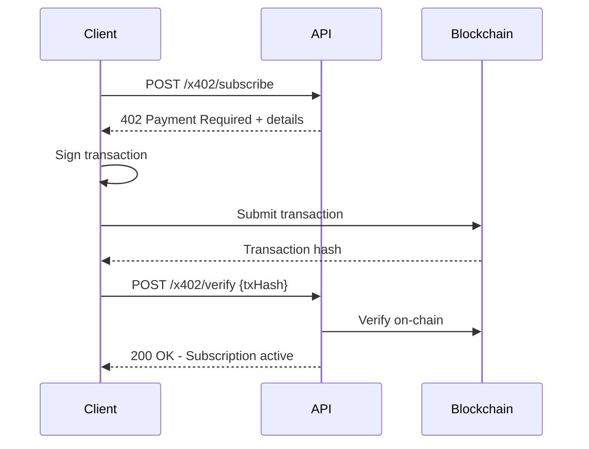
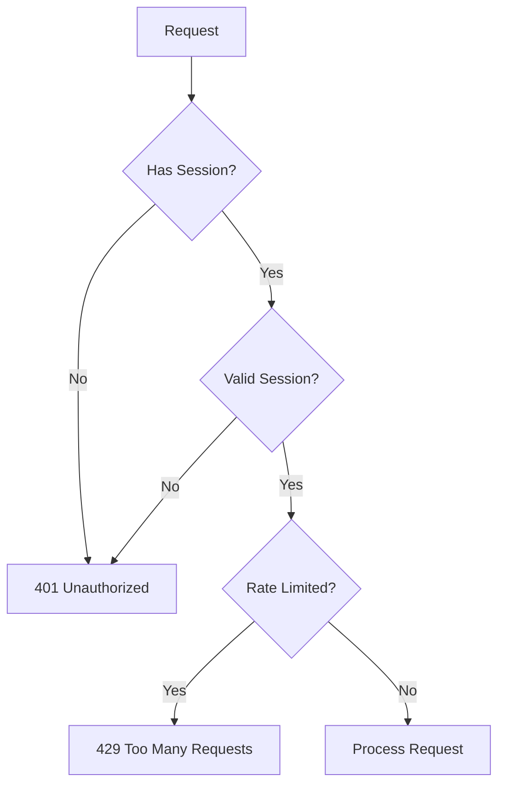

# API Reference

Barzakh AI provides a comprehensive REST API for all platform functionality. All endpoints are protected by Cloudflare API Shield with OpenAPI schema validation.

**Base URLs:**
- Production: `https://chat.barzakh.tech`
- Staging: `https://staging.barzakh.tech`

---

## Authentication

### OAuth Providers

```
GET  /api/auth/callback/{provider}  - OAuth callback handler
POST /api/auth/signin               - Sign in with credentials
POST /api/auth/signout              - Sign out user
GET  /api/auth/session              - Get current session
POST /api/auth/resend-otp           - Resend OTP code
```

### Wallet Authentication

```
GET  /api/auth/nonce?address={addr} - Get nonce for wallet signing
```

**Request:**
```http
GET /api/auth/nonce?address=0x742d35Cc6634C0532925a3b844Bc9e7595f...
```

**Response:**
```json
{
  "nonce": "Sign this message to authenticate: abc123..."
}
```

### Two-Factor Authentication (2FA)

```
POST /api/2fa/temp-login            - Initiate 2FA flow
POST /api/2fa/complete-login        - Complete login with TOTP
POST /api/2fa/forgot-password-verify - Verify password reset with 2FA
```

---

## Billing

### Stripe Integration

```
GET  /api/billing/subscription          - Get current subscription
POST /api/billing/create-checkout-session - Create Stripe checkout
POST /api/billing/manage-subscription    - Open customer portal
POST /api/billing/cancel-subscription    - Cancel subscription
GET  /api/billing/payment-methods        - List payment methods
POST /api/billing/create-setup-intent    - Add new payment method
GET  /api/billing/invoices               - Get billing history
POST /api/billing/update-subscription    - Change subscription plan
```

### x402 Crypto Payments

The x402 protocol enables native cryptocurrency payments for subscriptions.

```
POST /api/billing/x402/subscribe     - Initiate crypto payment
POST /api/billing/x402/verify        - Verify transaction on-chain
GET  /api/billing/x402/verify-wallet - Get wallet verification nonce
POST /api/billing/x402/verify-wallet - Verify wallet ownership
```

**Payment Flow:**



---

## Account Management

### Account Operations

```
POST /api/account/delete           - Delete account (with re-auth)
POST /api/account/delete/send-otp  - Send OTP for deletion verification
```

### Email Change

```
POST /api/changes-email/request-email-change  - Request email change
POST /api/changes-email/verify-email-change   - Verify with code
```

---

## Settings

### User Settings

```
GET   /api/settings         - Get user settings
PATCH /api/settings         - Update user settings
```

### Wallet Binding

```
GET  /api/settings/wallet/bind     - Get bind nonce
POST /api/settings/wallet/bind     - Bind wallet to account
POST /api/settings/wallet/unbind   - Remove wallet from account
```

---

## Wallet Verification

Verify wallet ownership for payments or account binding:

```
GET  /api/wallet/verify-signature  - Get signature message
POST /api/wallet/verify-signature  - Verify and link wallet
```

**Request:**
```json
{
  "address": "0x742d35Cc6634C0532925a3b844Bc9e7595f...",
  "signature": "0x..."
}
```

**Response:**
```json
{
  "success": true,
  "message": "Wallet verified and linked",
  "walletAddress": "0x742d35Cc6634C0532925a3b844Bc9e7595f..."
}
```

---

## Error Responses

### Standard Error Codes

| Code | Description |
|------|-------------|
| 400 | Bad Request - Invalid parameters |
| 401 | Unauthorized - Authentication required |
| 403 | Forbidden - Invalid signature/session |
| 404 | Not Found - Resource doesn't exist |
| 409 | Conflict - Transaction pending (retry) |
| 429 | Too Many Requests - Rate limited |

### Error Response Format

```json
{
  "error": "Human-readable error message",
  "code": "ERROR_CODE",
  "details": {}
}
```

---

## Rate Limits

| Endpoint Category | Limit |
|-------------------|-------|
| Authentication | 10 req/min |
| Chat/AI | 60 req/min (varies by plan) |
| Billing | 20 req/min |
| Settings | 30 req/min |
| OTP Requests | 3 req/10min |

---

## Security

### Request Validation

All requests are validated against OpenAPI schema by Cloudflare API Shield:
- Parameter type checking
- Pattern validation (e.g., wallet addresses)
- Size limits enforcement

### Authentication Flow



---

## SDK Examples

### JavaScript/TypeScript

```typescript
// Wallet authentication
const nonce = await fetch('/api/auth/nonce?address=' + address);
const signature = await wallet.signMessage(nonce.nonce);
const session = await fetch('/api/auth/signin', {
  method: 'POST',
  body: JSON.stringify({ address, signature })
});

// x402 crypto payment
const payment = await fetch('/api/billing/x402/subscribe', {
  method: 'POST',
  body: JSON.stringify({ planId: 'pro' })
});
// Returns 402 with payment details

// After on-chain transaction
const verify = await fetch('/api/billing/x402/verify', {
  method: 'POST',
  body: JSON.stringify({ txHash: '0x...' })
});
```

---

## OpenAPI Schema

Full OpenAPI 3.0 schema is available for API integration and validation.

The schema includes:
- All endpoints with request/response schemas
- Authentication requirements
- Parameter validation rules
- Error response definitions
