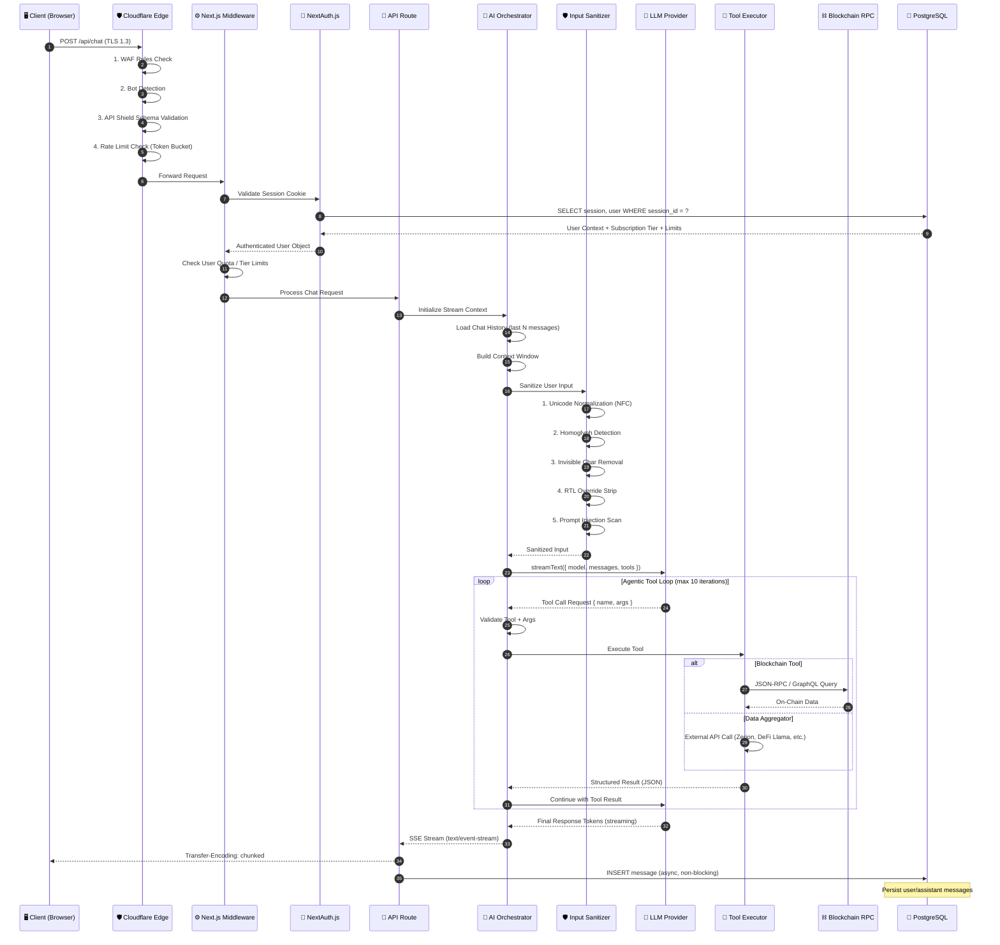
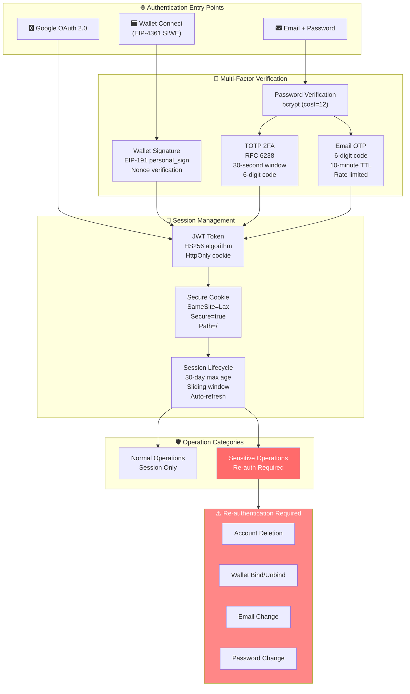
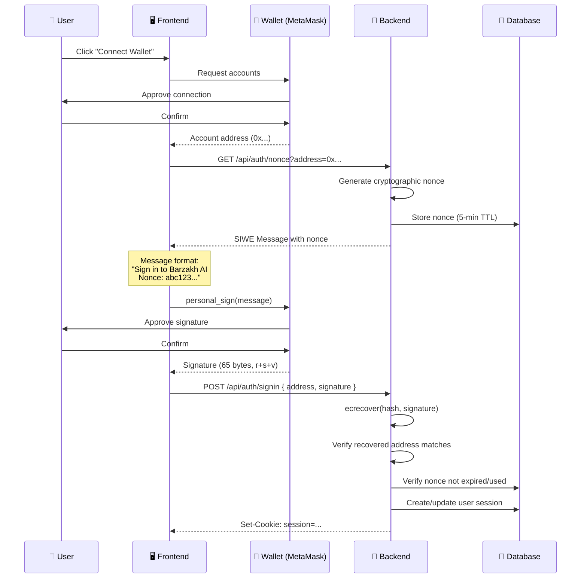
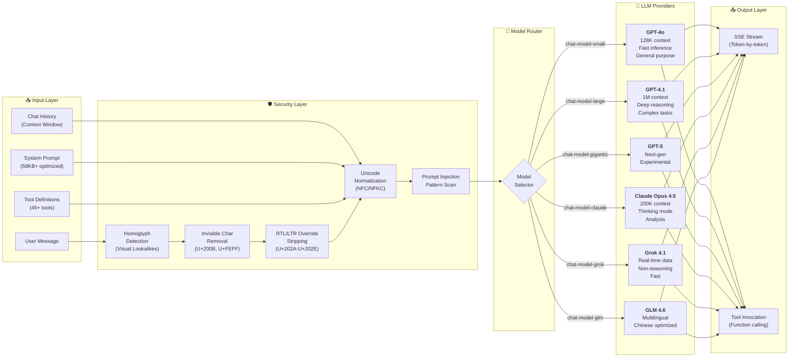
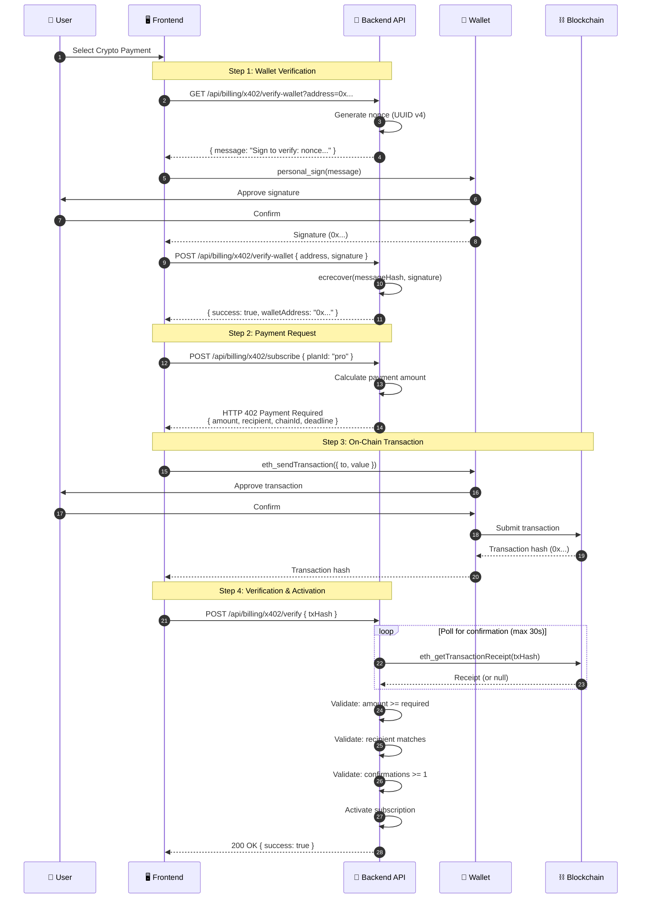

# Architecture

### Barzakh AI System Architecture Documentation

## Table of Contents
- [System Overview](#system-overview)
- [Request Lifecycle](#request-lifecycle)
- [Authentication Architecture](#authentication-architecture)
- [AI Pipeline](#ai-pipeline)
- [Multi-Chain Integration](#multi-chain-integration)
- [x402 Payment Protocol](#x402-payment-protocol)
- [Security Layers](#security-layers)
- [Infrastructure](#infrastructure)

---

## System Overview

Barzakh AI is built on a modern, event-driven architecture optimized for real-time AI streaming and blockchain data processing.

### Layer Architecture

```
┌──────────────────────────────────────────────────────────────────────────────────────┐
│                                    EDGE LAYER                                        │
│  ┌─────────────────┐  ┌─────────────────┐  ┌─────────────────┐  ┌─────────────────┐  │
│  │   Cloudflare    │  │   API Shield    │  │  Rate Limiter   │  │    R2 Storage   │  │
│  │   WAF + DDoS    │  │ OpenAPI 3.0 Spec│  │  Token Bucket   │  │   Object Store  │  │
│  └────────┬────────┘  └────────┬────────┘  └────────┬────────┘  └────────┬────────┘  │
└───────────┼────────────────────┼────────────────────┼────────────────────┼───────────┘
            │                    │                    │                    │
            └────────────────────┴────────────────────┴────────────────────┘
                                          │
                                          ▼
┌───────────────────────────────────────────────────────────────────────────────────────┐
│                              APPLICATION LAYER (Vercel)                               │
│  ┌─────────────────────────────────────────────────────────────────────────────────┐  │
│  │                         Next.js 15 (App Router)                                 │  │
│  │  ┌─────────────┐  ┌─────────────┐  ┌─────────────┐  ┌─────────────────────────┐ │  │
│  │  │   React 19  │  │   Server    │  │  API Routes │  │    Middleware Chain     │ │  │
│  │  │     RSC     │  │  Components │  │   (Edge)    │  │  Auth → Rate → Validate │ │  │
│  │  └─────────────┘  └─────────────┘  └─────────────┘  └─────────────────────────┘ │  │
│  └─────────────────────────────────────────────────────────────────────────────────┘  │
└───────────────────────────────────────────────────────────────────────────────────────┘
                                          │
                                          ▼
┌─────────────────────────────────────────────────────────────────────────────────────┐
│                                   CORE SERVICES                                     │
│  ┌─────────────────┐  ┌─────────────────┐  ┌─────────────────┐  ┌─────────────────┐ │
│  │  Chat Engine    │  │ AI Orchestrator │  │  Tool Executor  │  │ Stream Processor│ │
│  │  Vercel AI SDK  │  │  Multi-Model    │  │   45+ Tools     │  │   SSE/Chunks    │ │
│  └────────┬────────┘  └────────┬────────┘  └────────┬────────┘  └────────┬────────┘ │
└───────────┼────────────────────┼────────────────────┼────────────────────┼──────────┘
            │                    │                    │                    │
            └────────────────────┴────────────────────┴────────────────────┘
                                          │
                                          ▼
┌─────────────────────────────────────────────────────────────────────────────────────┐
│                                   AI LAYER                                          │
│  ┌───────────────────────────────────────────────────────────────────────────────┐  │
│  │                           LLM Provider Abstraction                            │  │
│  │  ┌──────────┐  ┌──────────┐  ┌──────────┐  ┌──────────┐  ┌──────────────────┐ │  │
│  │  │  OpenAI  │  │Anthropic │  │   xAI    │  │  Zhipu   │  │   CometAPI       │ │  │
│  │  │ GPT-4o   │  │  Claude  │  │  Grok 2  │  │ GLM-4.6  │  │  (Aggregator)    │ │  │
│  │  │ o1/o3    │  │ Sonnet   │  │          │  │          │  │                  │ │  │
│  │  │          │  │ 4/4.5    │  │          │  │          │  │                  │ │  │
│  │  └──────────┘  └──────────┘  └──────────┘  └──────────┘  └──────────────────┘ │  │
│  └───────────────────────────────────────────────────────────────────────────────┘  │
│  ┌─────────────────┐  ┌─────────────────┐  ┌─────────────────────────────────────┐  │
│  │ Prompt Engineer │  │ Input Sanitizer │  │        Response Streamer            │  │
│  │  System Prompts │  │ Injection Guard │  │    Token-by-Token SSE Output        │  │
│  └─────────────────┘  └─────────────────┘  └─────────────────────────────────────┘  │
└─────────────────────────────────────────────────────────────────────────────────────┘
                                          │
                                          ▼
┌───────────────────────────────────────────────────────────────────────────────────────┐
│                              BLOCKCHAIN TOOLS LAYER                                   │
│  ┌─────────────────────────────────────────────────────────────────────────────────┐  │
│  │                         Chain-Specific Tool Modules                             │  │
│  │  ┌──────────┐  ┌──────────┐  ┌──────────┐  ┌──────────┐  ┌──────────────────┐   │  │
│  │  │  Cronos  │  │   EVM    │  │  Aptos   │  │   Flow   │  │       SEI        │   │  │
│  │  │ zkEVM +  │  │ Ethereum │  │   Sui    │  │ Cadence  │  │  Cosmos SDK      │   │  │
│  │  │  EVM     │  │ Polygon  │  │  Move    │  │  FCL     │  │  IBC Transfers   │   │  │
│  │  └──────────┘  └──────────┘  └──────────┘  └──────────┘  └──────────────────┘   │  │
│  └─────────────────────────────────────────────────────────────────────────────────┘  │
│  ┌─────────────────────────────────────────────────────────────────────────────────┐  │
│  │                            Utility Tool Modules                                 │  │
│  │  ┌──────────┐  ┌──────────┐  ┌──────────┐  ┌──────────┐  ┌──────────────────┐   │  │
│  │  │DeFi Llama│  │Web Search│  │  News    │  │ X/Twitter│  │  Image Gen       │   │  │
│  │  │   TVL    │  │  Tavily  │  │  Search  │  │  Search  │  │  Gemini 2.5      │   │  │
│  │  │   API    │  │  Search  │  │   API    │  │   API    │  │   Flash/Pro      │   │  │
│  │  └──────────┘  └──────────┘  └──────────┘  └──────────┘  └──────────────────┘   │  │
│  └─────────────────────────────────────────────────────────────────────────────────┘  │
└───────────────────────────────────────────────────────────────────────────────────────┘
                                          │
                                          ▼
┌──────────────────────────────────────────────────────────────────────────────────────┐
│                                  DATA LAYER                                          │
│  ┌─────────────────┐  ┌─────────────────┐  ┌─────────────────┐  ┌─────────────────┐  │
│  │   PostgreSQL    │  │  Cloudflare R2  │  │   Drizzle ORM   │  │   Connection    │  │
│  │   (Neon/Turso)  │  │  Object Storage │  │   Type-Safe     │  │    Pooling      │  │
│  └─────────────────┘  └─────────────────┘  └─────────────────┘  └─────────────────┘  │
└──────────────────────────────────────────────────────────────────────────────────────┘
```

---

## Request Lifecycle

### Chat Request Flow



---

## Authentication Architecture

### Multi-Factor Authentication Flow



### Wallet Authentication (EIP-4361 SIWE)



---

## AI Pipeline

### Input Processing & Model Routing



---

## Multi-Chain Integration

### Supported Chains

| Chain | SDK | Network | RPC Provider | Capabilities |
|-------|-----|---------|--------------|--------------|
| **Cronos** | `ethers.js v6` | Cronos Mainnet | Cronos RPC | EVM transactions, CRC-20, DeFi |
| **Ethereum** | `ethers.js v6` | Mainnet | Infura/Alchemy | ENS, ERC-20/721/1155, Uniswap |
| **Polygon** | `ethers.js v6` | PoS Mainnet | QuickNode | L2 transactions, NFTs |
| **Aptos** | `@aptos-labs/ts-sdk` | Mainnet | Aptos Fullnode | Move resources, coins |
| **Flow** | `@onflow/fcl` | Mainnet | Flow Access | Cadence scripts, NFTs |
| **SEI** | `@sei-js/core` | Pacific-1 | SEI RPC | Cosmos SDK, IBC |
| **Wormhole** | Custom | Multi-chain | Guardian Net | Cross-chain verification |

### Chain Adapter Pattern

```typescript
// Simplified chain adapter interface
interface ChainAdapter {
  getBalance(address: string): Promise<Balance>
  getTransactions(address: string, limit: number): Promise<Transaction[]>
  getTokenBalances(address: string): Promise<TokenBalance[]>
  getNFTs(address: string): Promise<NFT[]>
}

// Implementation per chain
class CronosAdapter implements ChainAdapter { /* ethers.js */ }
class AptosAdapter implements ChainAdapter { /* @aptos-labs/ts-sdk */ }
class FlowAdapter implements ChainAdapter { /* @onflow/fcl */ }
```

---

## x402 Payment Protocol

### Crypto Payment Flow



---

## Security Layers

### 4-Layer Defense Architecture

```
┌──────────────────────────────────────────────────────────────────────────────────────┐
│                           AI SECURITY DEFENSE LAYERS                                 │
├───────────────────────────────────────────────────────────────────────────────────── ┤
│                                                                                      │
│  ┌──────────────────────────────────────────────────────────────────────────────┐    │
│  │  LAYER 1: INPUT SANITIZATION                                                 │    │
│  │  ┌─────────────┐ ┌─────────────┐ ┌─────────────┐ ┌──────────────────────┐    │    │
│  │  │ Homoglyph   │ │ Invisible   │ │ RTL/LTR     │ │ Unicode              │    │    │
│  │  │ Detection   │ │ Char Strip  │ │ Override    │ │ Normalization        │    │    │
│  │  │ (Lookalikes)│ │ (U+200B,etc)│ │ Removal     │ │ (NFC/NFKC)           │    │    │
│  │  └─────────────┘ └─────────────┘ └─────────────┘ └──────────────────────┘    │    │
│  └──────────────────────────────────────────────────────────────────────────────┘    │
│                                       │                                              │
│                                       ▼                                              │
│  ┌──────────────────────────────────────────────────────────────────────────────┐    │
│  │  LAYER 2: PROMPT INJECTION DEFENSE                                           │    │
│  │  ┌─────────────┐ ┌─────────────┐ ┌─────────────┐ ┌──────────────────────┐    │    │
│  │  │ Direct      │ │ Indirect    │ │ Jailbreak   │ │ Role/Context         │    │    │
│  │  │ Injection   │ │ Injection   │ │ Pattern     │ │ Manipulation         │    │    │
│  │  │ Detection   │ │ (via URLs)  │ │ Matching    │ │ Prevention           │    │    │
│  │  └─────────────┘ └─────────────┘ └─────────────┘ └──────────────────────┘    │    │
│  └──────────────────────────────────────────────────────────────────────────────┘    │
│                                       │                                              │
│                                       ▼                                              │
│  ┌──────────────────────────────────────────────────────────────────────────────┐    │
│  │  LAYER 3: MEDIA & FILE PROTECTION                                            │    │
│  │  ┌─────────────┐ ┌─────────────┐ ┌─────────────┐ ┌──────────────────────┐    │    │
│  │  │ Polyglot    │ │ EXIF/Meta   │ │Steganography│ │ File Type            │    │    │
│  │  │ File        │ │ Data Strip  │ │ Detection   │ │ Validation           │    │    │
│  │  │ Detection   │ │             │ │             │ │ (Magic Bytes)        │    │    │
│  │  └─────────────┘ └─────────────┘ └─────────────┘ └──────────────────────┘    │    │
│  └──────────────────────────────────────────────────────────────────────────────┘    │
│                                       │                                              │
│                                       ▼                                              │
│  ┌──────────────────────────────────────────────────────────────────────────────┐    │
│  │  LAYER 4: MODEL PROTECTION                                                   │    │
│  │  ┌─────────────┐ ┌─────────────┐ ┌─────────────┐ ┌──────────────────────┐    │    │
│  │  │ Sponge      │ │ Model       │ │ Model       │ │ Output               │    │    │
│  │  │ Attack      │ │ Extraction  │ │ Inversion   │ │ Filtering            │    │    │
│  │  │ Prevention  │ │ Defense     │ │ Guard       │ │ (PII, Secrets)       │    │    │
│  │  └─────────────┘ └─────────────┘ └─────────────┘ └──────────────────────┘    │    │
│  └──────────────────────────────────────────────────────────────────────────────┘    │
│                                       │                                              │
│                                       ▼                                              │
│  ┌──────────────────────────────────────────────────────────────────────────────┐    │
│  │  LAYER 5: RUNTIME MONITORING                                                 │    │
│  │  ┌─────────────┐ ┌─────────────┐ ┌─────────────┐ ┌──────────────────────┐    │    │
│  │  │ Rate        │ │ Anomaly     │ │ Behavioral  │ │ Audit                │    │    │
│  │  │ Limiting    │ │ Detection   │ │ Analysis    │ │ Logging              │    │    │
│  │  │ (Token/IP)  │ │ (Pattern)   │ │ (Usage)     │ │ (Compliance)         │    │    │
│  │  └─────────────┘ └─────────────┘ └─────────────┘ └──────────────────────┘    │    │
│  └──────────────────────────────────────────────────────────────────────────────┘    │
│                                                                                      │
└──────────────────────────────────────────────────────────────────────────────────────┘
```

### Threat Protection Matrix

| Threat Category | Attack Vector | Defense Mechanism |
|-----------------|---------------|-------------------|
| **Prompt Injection** | Direct system prompt override | Pattern matching, input boundary enforcement |
| **Indirect Injection** | Malicious content via URLs/files | Content isolation, sandboxed parsing |
| **Jailbreak Attempts** | Role manipulation, DAN prompts | System prompt hardening, output monitoring |
| **Homoglyph Attacks** | Lookalike Unicode characters | Character normalization, visual similarity detection |
| **Invisible Characters** | Zero-width chars (U+200B, U+FEFF) | Whitespace stripping, control char removal |
| **RTL Override** | Bidirectional text manipulation | Unicode Bidi control removal |
| **Polyglot Files** | Images containing executable code | Magic byte validation, metadata stripping |
| **Sponge Attacks** | DoS via expensive computations | Token limits, complexity analysis, timeouts |
| **Model Extraction** | Query-based model stealing | Rate limiting, query pattern analysis |

---

## Infrastructure

### Deployment Topology

```
┌─────────────────────────────────────────────────────────────────────────────┐
│                              CLOUDFLARE EDGE                                │
│  ┌────────────────────────────────────────────────────────────────────────┐ │
│  │  WAF │ DDoS Protection │ API Shield │ Rate Limiting │ Bot Management   │ │
│  └────────────────────────────────────────────────────────────────────────┘ │
│  ┌────────────────────────────────────────────────────────────────────────┐ │
│  │                         Cloudflare R2                                  │ │
│  │              (Object Storage - Images, Files, Attachments)             │ │
│  └────────────────────────────────────────────────────────────────────────┘ │
└─────────────────────────────────────────────────────────────────────────────┘
                                     │
                                     ▼
┌─────────────────────────────────────────────────────────────────────────────┐
│                              VERCEL PLATFORM                                │
│  ┌─────────────────────┐  ┌─────────────────────┐  ┌─────────────────────┐  │
│  │   Edge Functions    │  │  Serverless Fns     │  │    Static Assets    │  │
│  │   (Middleware)      │  │  (API Routes)       │  │    (CDN Cached)     │  │
│  │   < 1ms cold start  │  │  Node.js Runtime    │  │    Global Edge      │  │
│  └─────────────────────┘  └─────────────────────┘  └─────────────────────┘  │
└─────────────────────────────────────────────────────────────────────────────┘
                                     │
                    ┌────────────────┴────────────────┐
                    ▼                                 ▼
┌─────────────────────────────┐      ┌─────────────────────────────┐
│      POSTGRESQL (Neon)      │      │     EXTERNAL SERVICES       │
│  ┌───────────────────────┐  │      │  ┌───────────────────────┐  │
│  │   Connection Pooling  │  │      │  │   Zerion Portfolio    │  │
│  │   Drizzle ORM         │  │      │  │   DeFi Llama TVL      │  │
│  │   Prepared Statements │  │      │  │   CometAPI (LLM)      │  │
│  │   Automatic Backups   │  │      │  │   OpenAI / Anthropic  │  │
│  └───────────────────────┘  │      │  └───────────────────────┘  │
└─────────────────────────────┘      └─────────────────────────────┘
```

### Environment Configuration

| Environment | Domain | Branch | Purpose |
|-------------|--------|--------|---------|
| **Production** | chat.barzakh.tech | main | Live application |
| **API Production** | staging.barzakh.tech | Live application |
