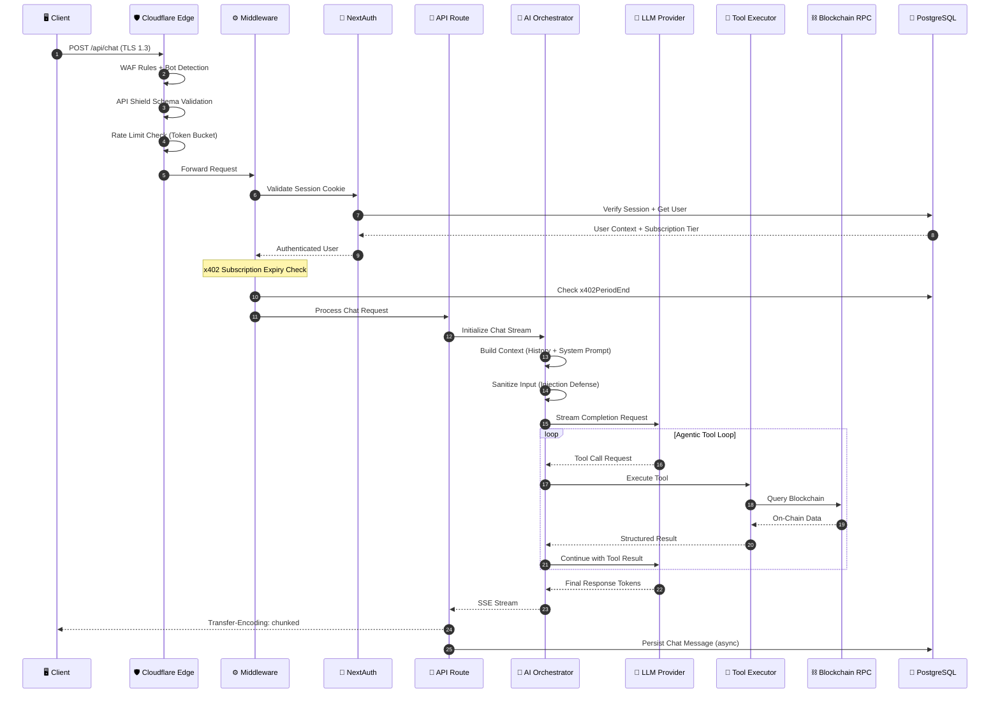
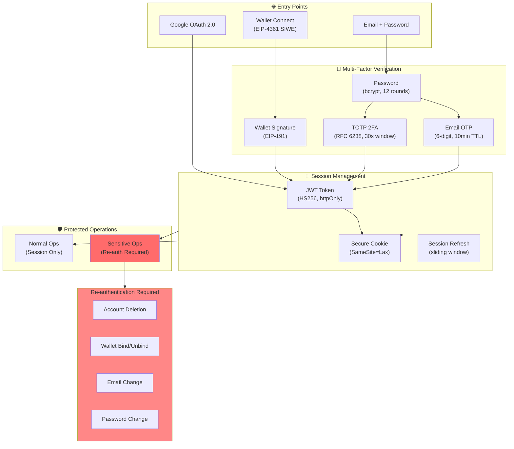
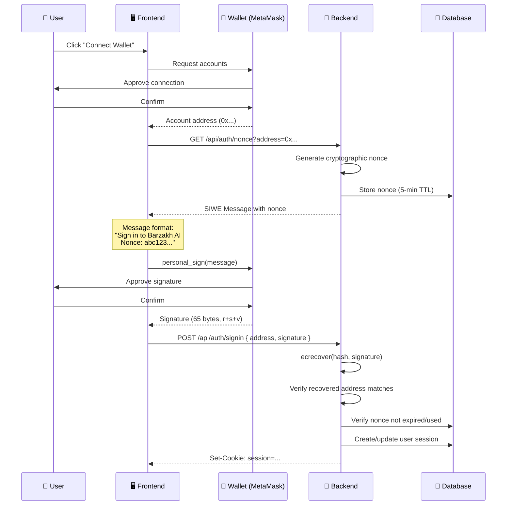
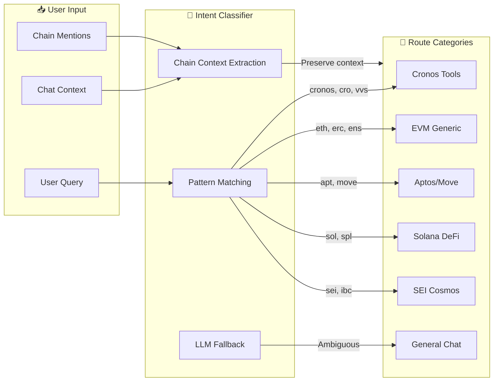

# Architecture

> **Barzakh AI System Architecture Documentation**

## Table of Contents
- [System Overview](#system-overview)
- [Tech Stack](#tech-stack)
- [Request Lifecycle](#request-lifecycle)
- [Authentication Architecture](#authentication-architecture)
- [AI Pipeline](#ai-pipeline)
- [Multi-Chain Integration](#multi-chain-integration)
- [Project Structure](#project-structure)
- [Infrastructure](#infrastructure)

---

## System Overview

Barzakh AI is built on a modern, event-driven architecture optimized for real-time AI streaming and blockchain data processing.

> **Turborepo Monorepo** with pnpm workspaces for optimal DX and build performance

### Layer Architecture

```
┌──────────────────────────────────────────────────────────────────────────────────────┐
│                                    EDGE LAYER                                        │
│  ┌─────────────────┐  ┌─────────────────┐  ┌─────────────────┐  ┌─────────────────┐  │
│  │   Cloudflare    │  │   API Shield    │  │  Rate Limiter   │  │    R2 Storage   │  │
│  │   WAF + DDoS    │  │ OpenAPI 3.0 Spec│  │  Token Bucket   │  │   Object Store  │  │
│  └────────┬────────┘  └────────┬────────┘  └────────┬────────┘  └────────┬────────┘  │
└───────────┼────────────────────┼────────────────────┼────────────────────┼───────────┘
            │                    │                    │                    │
            └────────────────────┴────────────────────┴────────────────────┘
                                          │
                                          ▼
┌───────────────────────────────────────────────────────────────────────────────────────┐
│                              APPLICATION LAYER (Vercel)                               │
│  ┌─────────────────────────────────────────────────────────────────────────────────┐  │
│  │                         Next.js 15.4 (App Router + RSC)                         │  │
│  │  ┌─────────────┐  ┌─────────────┐  ┌─────────────┐  ┌─────────────────────────┐ │  │
│  │  │  React 19   │  │   Server    │  │  API Routes │  │    Middleware Chain     │ │  │
│  │  │     RSC     │  │  Components │  │   (Edge)    │  │  Auth → Rate → Validate │ │  │
│  │  └─────────────┘  └─────────────┘  └─────────────┘  └─────────────────────────┘ │  │
│  └─────────────────────────────────────────────────────────────────────────────────┘  │
└───────────────────────────────────────────────────────────────────────────────────────┘
                                          │
                                          ▼
┌─────────────────────────────────────────────────────────────────────────────────────┐
│                                   CORE SERVICES                                     │
│  ┌─────────────────┐  ┌─────────────────┐  ┌─────────────────┐  ┌─────────────────┐ │
│  │  Chat Engine    │  │ AI Orchestrator │  │  Tool Executor  │  │ Stream Processor│ │
│  │  Vercel AI SDK  │  │  Multi-Model    │  │   50+ Tools     │  │   SSE/Chunks    │ │
│  │    v4.1.17      │  │  Intent Router  │  │   12 Chains     │  │  Transfer-Enc   │ │
│  └────────┬────────┘  └────────┬────────┘  └────────┬────────┘  └────────┬────────┘ │
└───────────┼────────────────────┼────────────────────┼────────────────────┼──────────┘
            │                    │                    │                    │
            └────────────────────┴────────────────────┴────────────────────┘
                                          │
                                          ▼
┌─────────────────────────────────────────────────────────────────────────────────────┐
│                                   AI LAYER                                          │
│  ┌───────────────────────────────────────────────────────────────────────────────┐  │
│  │                           LLM Provider Abstraction                            │  │
│  │  ┌──────────┐  ┌──────────┐  ┌──────────┐  ┌──────────┐  ┌──────────────────┐ │  │
│  │  │  OpenAI  │  │Anthropic │  │   xAI    │  │  Zhipu   │  │   CometAPI       │ │  │
│  │  │ GPT-4o/5 │  │ Claude   │  │  Grok 2  │  │ GLM-4.6  │  │  (Aggregator)    │ │  │
│  │  │ o1/o3    │  │ Opus 4.5 │  │   4.1    │  │  Plus    │  │  Multi-Provider  │ │  │
│  │  └──────────┘  └──────────┘  └──────────┘  └──────────┘  └──────────────────┘ │  │
│  └───────────────────────────────────────────────────────────────────────────────┘  │
│  ┌─────────────────┐  ┌─────────────────┐  ┌─────────────────────────────────────┐  │
│  │ Prompt Engineer │  │ Input Sanitizer │  │        Response Streamer            │  │
│  │  58KB+ System   │  │ Injection Guard │  │    Token-by-Token SSE Output        │  │
│  └─────────────────┘  └─────────────────┘  └─────────────────────────────────────┘  │
└─────────────────────────────────────────────────────────────────────────────────────┘
                                          │
                                          ▼
┌───────────────────────────────────────────────────────────────────────────────────────┐
│                              BLOCKCHAIN TOOLS LAYER                                   │
│  ┌─────────────────────────────────────────────────────────────────────────────────┐  │
│  │                         Chain-Specific Tool Modules                             │  │
│  │  ┌──────────┐  ┌──────────┐  ┌──────────┐  ┌──────────┐  ┌──────────────────┐   │  │
│  │  │  Cronos  │  │   EVM    │  │  Aptos   │  │   Flow   │  │       SEI        │   │  │
│  │  │ VVS DEX  │  │ Ethereum │  │   Move   │  │ Cadence  │  │  Cosmos SDK      │   │  │
│  │  │ Explorer │  │ Polygon  │  │  Names   │  │  NFTs    │  │  IBC Protocol    │   │  │
│  │  └──────────┘  └──────────┘  └──────────┘  └──────────┘  └──────────────────┘   │  │
│  │  ┌──────────┐  ┌──────────┐  ┌──────────┐  ┌──────────┐  ┌──────────────────┐   │  │
│  │  │  Solana  │  │   Zeta   │  │  Monad   │  │ Wormhole │  │    Vana/CC       │   │  │
│  │  │   RPC    │  │  ZetaVM  │  │   Next   │  │  Bridge  │  │  Data Networks   │   │  │
│  │  │  DeFi    │  │  Testnet │  │   Gen    │  │  X-Chain │  │    Protocol      │   │  │
│  │  └──────────┘  └──────────┘  └──────────┘  └──────────┘  └──────────────────┘   │  │
│  └─────────────────────────────────────────────────────────────────────────────────┘  │
│  ┌─────────────────────────────────────────────────────────────────────────────────┐  │
│  │                            Utility Tool Modules                                 │  │
│  │  ┌──────────┐  ┌──────────┐  ┌──────────┐  ┌──────────┐  ┌──────────────────┐   │  │
│  │  │DeFi Llama│  │Web Search│  │  News    │  │ X/Twitter│  │  Image Gen       │   │  │
│  │  │   TVL    │  │  Tavily  │  │  Search  │  │  Search  │  │  Gemini 2.5      │   │  │
│  │  │   API    │  │  Search  │  │   API    │  │   API    │  │   Imagen 3       │   │  │
│  │  └──────────┘  └──────────┘  └──────────┘  └──────────┘  └──────────────────┘   │  │
│  └─────────────────────────────────────────────────────────────────────────────────┘  │
└───────────────────────────────────────────────────────────────────────────────────────┘
                                          │
                                          ▼
┌──────────────────────────────────────────────────────────────────────────────────────┐
│                                  DATA LAYER                                          │
│  ┌─────────────────┐  ┌─────────────────┐  ┌─────────────────┐  ┌─────────────────┐  │
│  │   PostgreSQL    │  │  Cloudflare R2  │  │   Drizzle ORM   │  │   Connection    │  │
│  │   (Neon/Turso)  │  │  Object Storage │  │   Type-Safe     │  │    Pooling      │  │
│  │    v0.34.1      │  │   File Upload   │  │   Migrations    │  │   Prepared      │  │
│  └─────────────────┘  └─────────────────┘  └─────────────────┘  └─────────────────┘  │
└──────────────────────────────────────────────────────────────────────────────────────┘
```

---

## Tech Stack

### Core Framework

| Layer | Technology | Version | Purpose |
|-------|------------|---------|---------|
| **Runtime** | Node.js | 18+ | Server runtime |
| **Package Manager** | pnpm | 8.6.12 | Fast, disk-efficient |
| **Monorepo** | Turborepo | 2.4.4 | Build orchestration |
| **Framework** | Next.js | 15.4.10 | Full-stack React framework |
| **UI Library** | React | 19.0.1 | UI components (RSC enabled) |
| **Language** | TypeScript | 5.6.3 | Type safety |

### Frontend Stack

| Category | Technologies |
|----------|-------------|
| **Styling** | TailwindCSS 3.4, CSS Variables, Tailwind Merge |
| **Components** | Radix UI primitives, Lucide React icons, Framer Motion |
| **State** | React hooks, useSWR, TanStack Query 5.90 |
| **Forms** | Zod 3.25 validation, React Hook Form patterns |
| **Editor** | Prosemirror, CodeMirror 6 |
| **Animations** | Framer Motion 11.3, Lottie React |

### Backend Stack

| Category | Technologies |
|----------|-------------|
| **API** | Next.js API Routes (Edge + Node), Vercel Functions |
| **AI SDK** | Vercel AI SDK 4.1.17 |
| **Database** | PostgreSQL 15, Drizzle ORM 0.34.1 |
| **Auth** | NextAuth.js 5.0.0-beta.30 |
| **Payments** | Stripe 18.5, x402 Protocol (EIP-3009) |
| **Email** | Nodemailer 6.10 |

### Web3 Stack

| Category | Technologies |
|----------|-------------|
| **Wallet** | Wagmi 2.19, RainbowKit 2.2.9 |
| **Ethereum** | Viem 2.41, ethers.js v6 |
| **Chains** | Cronos, Ethereum, Polygon, Aptos, Solana, Flow, SEI |
| **Protocols** | EIP-3009 (TransferWithAuthorization), EIP-712, EIP-191 |

### Infrastructure

| Category | Technologies |
|----------|-------------|
| **Hosting** | Vercel (Frontend), Cloudflare (Edge) |
| **Database** | Neon PostgreSQL (Serverless) |
| **Storage** | Cloudflare R2 (S3-compatible) |
| **CDN** | Vercel Edge Network, Cloudflare |
| **Monitoring** | Sentry 9.11, Vercel Analytics |

---

## Request Lifecycle

### Chat Request Flow



---

## Authentication Architecture

### Multi-Factor Authentication Flow



### Wallet Authentication (EIP-4361 SIWE)



---

## AI Pipeline

### Input Processing & Model Routing



---

## Multi-Chain Integration

### Supported Chains

| Chain | SDK | Network | RPC Provider | Capabilities |
|-------|-----|---------|--------------|--------------| 
| **Cronos** | `viem` + `ethers.js v6` | Mainnet + Testnet | Cronos RPC | EVM tx, CRC-20, VVS DEX |
| **Ethereum** | `viem` + `ethers.js v6` | Mainnet | Infura/Alchemy | ENS, ERC-20/721/1155 |
| **Polygon** | `viem` | PoS Mainnet | QuickNode | Low-cost tx, NFTs |
| **Aptos** | `@aptos-labs/ts-sdk` | Mainnet | Aptos Fullnode | Move, ANS names |
| **Flow** | `@onflow/fcl` | Mainnet | Flow Access Node | Cadence, NFTs |
| **SEI** | `@sei-js/core` | Pacific-1 | SEI RPC | Cosmos SDK, IBC |
| **Solana** | Native JSON-RPC | Mainnet | Helius/QuickNode | SPL tokens, DeFi |

### Chain Adapter Pattern

```typescript
// Simplified chain adapter interface
interface ChainAdapter {
  getBalance(address: string): Promise<Balance>
  getTransactions(address: string, limit: number): Promise<Transaction[]>
  getTokenBalances(address: string): Promise<TokenBalance[]>
  getNFTs(address: string): Promise<NFT[]>
}

// Implementation per chain
class CronosAdapter implements ChainAdapter { /* ethers.js */ }
class AptosAdapter implements ChainAdapter { /* @aptos-labs/ts-sdk */ }
class FlowAdapter implements ChainAdapter { /* @onflow/fcl */ }
```

---

## Project Structure

```
barzakh-ai/
├── apps/
│   ├── frontend/                     # Next.js 15.4 Application
│   │   ├── app/
│   │   │   ├── (auth)/               # Auth pages (login, register, 2FA)
│   │   │   ├── (chat)/               # Chat interface + API routes
│   │   │   │   └── api/              # Protected API endpoints
│   │   │   │       └── chat/         # AI chat with tool execution
│   │   │   └── api/                  # Public API routes
│   │   │       ├── 2fa/              # TOTP setup & verification
│   │   │       ├── auth/             # NextAuth handlers
│   │   │       ├── billing/          # Stripe + x402 payments
│   │   │       │   └── x402/         # Crypto payment endpoints
│   │   │       │       ├── subscribe/   # Get payment requirements
│   │   │       │       ├── settle/      # Execute settlement
│   │   │       │       ├── verify/      # Verify transaction
│   │   │       │       └── verify-wallet/  # Wallet signature verification
│   │   │       ├── cron/             # Scheduled jobs
│   │   │       │   └── check-subscriptions/  # x402 expiry check (every 6h)
│   │   │       └── settings/         # User preferences
│   │   ├── components/
│   │   │   ├── message.tsx           # Chat message component
│   │   │   ├── settings/             # Settings UI
│   │   │   │   └── plans/
│   │   │   │       └── x402-payment-modal.tsx  # Crypto payment modal
│   │   │   └── ui/                   # Radix UI primitives
│   │   └── lib/
│   │       ├── db/                   # Drizzle ORM
│   │       │   ├── schema.ts         # Database schema
│   │       │   └── migrations/       # SQL migrations
│   │       ├── stripe.ts             # Stripe configuration
│   │       └── wagmi.ts              # Web3 configuration
│   │
│   └── backend/                      # Supplementary backend services
│
├── packages/
│   └── shared/                       # Shared utilities (@barzakh/shared)
│       └── src/lib/
│           ├── ai/
│           │   ├── models.ts         # Model configurations
│           │   ├── prompts.ts        # System prompts (58KB+)
│           │   ├── intent-classifier.ts  # Chain-aware routing
│           │   └── tools/            # 50+ blockchain tools
│           │       ├── cronos/       # Cronos Explorer + VVS DEX
│           │       │   ├── cronos-explorer.ts
│           │       │   └── vvs-swap.ts
│           │       ├── aptos/        # Aptos-specific
│           │       ├── solana/       # Solana-specific
│           │       ├── evm/          # EVM chains
│           │       ├── flow/         # Flow blockchain
│           │       ├── sei/          # SEI chain
│           │       ├── zeta/         # Zeta chain
│           │       ├── monad/        # Monad (testnet)
│           │       ├── wormhole/     # Cross-chain bridge
│           │       └── onchain/      # Cross-chain utilities
│           ├── payments/
│           │   └── x402-facilitator.ts  # x402 protocol implementation
│           ├── security/             # Input sanitization
│           └── utils/                # Shared utilities
│
├── docs/
│   ├── ARCHITECTURE.md               # This file
│   ├── FEATURES.md                   # AI models, blockchain tools
│   ├── PAYMENTS.md                   # x402 crypto payment protocol
│   ├── SECURITY.md                   # Security layers
│   ├── API.md                        # REST API reference
│   ├── DEMO.md                       # Demo info
│   └── cloudflare-api-schema.yaml    # OpenAPI 3.0 spec
│
├── turbo.json                        # Turborepo configuration
├── pnpm-workspace.yaml               # pnpm workspace config
└── package.json                      # Root package.json
```

---

## Infrastructure

### Deployment Topology

```
┌─────────────────────────────────────────────────────────────────────────────┐
│                              CLOUDFLARE EDGE                                │
│  ┌────────────────────────────────────────────────────────────────────────┐ │
│  │  WAF │ DDoS Protection │ API Shield │ Rate Limiting │ Bot Management   │ │
│  └────────────────────────────────────────────────────────────────────────┘ │
│  ┌────────────────────────────────────────────────────────────────────────┐ │
│  │                         Cloudflare R2                                  │ │
│  │              (Object Storage - Images, Files, Attachments)             │ │
│  └────────────────────────────────────────────────────────────────────────┘ │
└─────────────────────────────────────────────────────────────────────────────┘
                                     │
                                     ▼
┌─────────────────────────────────────────────────────────────────────────────┐
│                              VERCEL PLATFORM                                │
│  ┌─────────────────────┐  ┌─────────────────────┐  ┌─────────────────────┐  │
│  │   Edge Functions    │  │  Serverless Fns     │  │    Static Assets    │  │
│  │   (Middleware)      │  │  (API Routes)       │  │    (CDN Cached)     │  │
│  │   < 1ms cold start  │  │  Node.js Runtime    │  │    Global Edge      │  │
│  └─────────────────────┘  └─────────────────────┘  └─────────────────────┘  │
└─────────────────────────────────────────────────────────────────────────────┘
                                     │
                    ┌────────────────┴────────────────┐
                    ▼                                 ▼
┌─────────────────────────────┐      ┌─────────────────────────────┐
│      POSTGRESQL (Neon)      │      │     EXTERNAL SERVICES       │
│  ┌───────────────────────┐  │      │  ┌───────────────────────┐  │
│  │   Connection Pooling  │  │      │  │   Zerion Portfolio    │  │
│  │   Drizzle ORM         │  │      │  │   DeFi Llama TVL      │  │
│  │   Prepared Statements │  │      │  │   CometAPI (LLM)      │  │
│  │   Automatic Backups   │  │      │  │   OpenAI / Anthropic  │  │
│  └───────────────────────┘  │      │  └───────────────────────┘  │
└─────────────────────────────┘      └─────────────────────────────┘
```

### Environment Configuration

| Environment | Domain | Branch | Purpose |
|-------------|--------|--------|---------|
| **Production** | chat.barzakh.tech | main | Live application |
