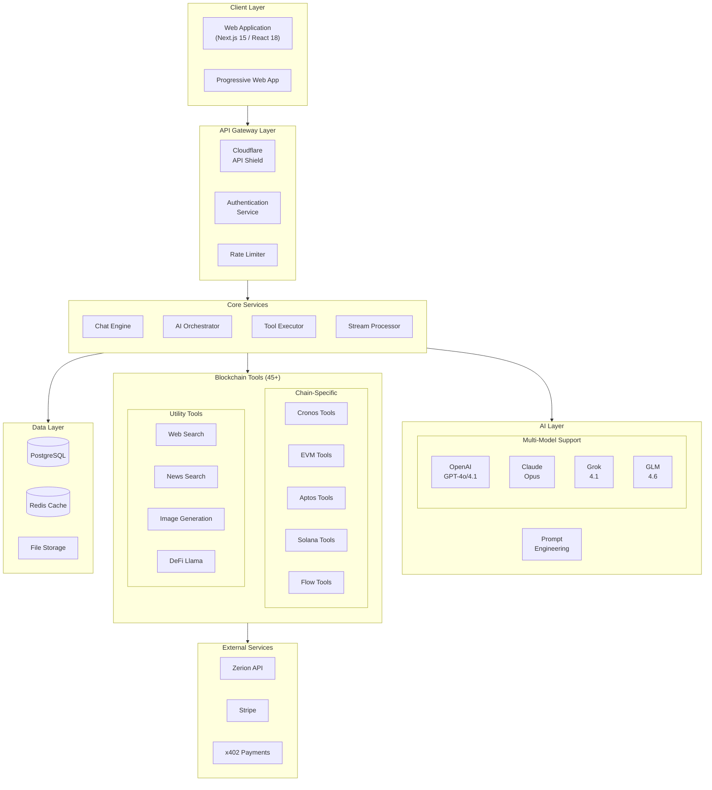
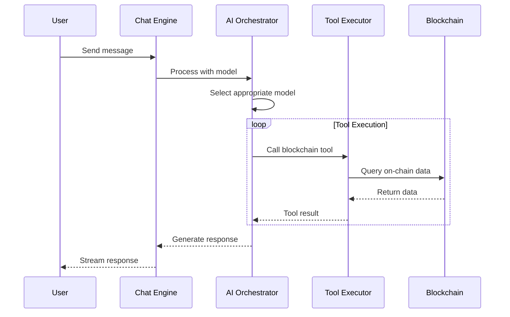
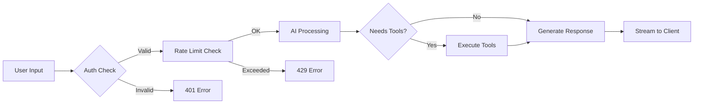
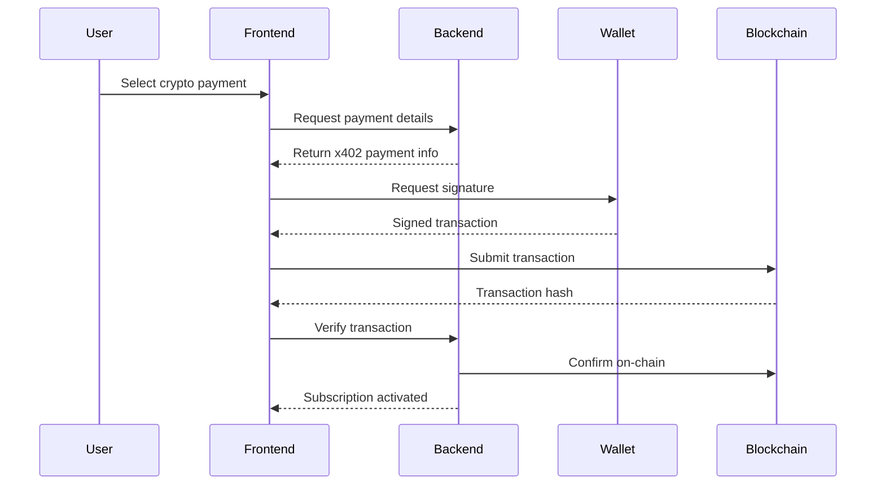
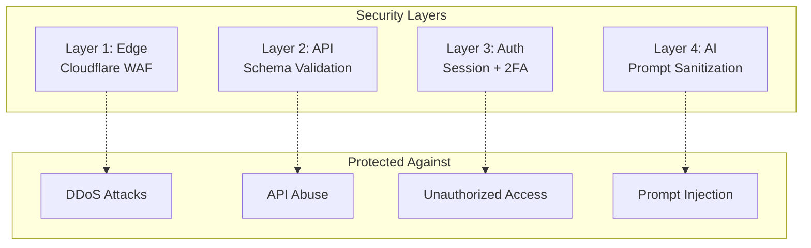

# Architecture Overview

## System Architecture

Barzakh AI is built on a modern, scalable architecture designed for real-time blockchain analytics and AI-powered insights.

---

## Component Details

### 🖥️ Client Layer

| Component | Technology | Purpose |
|-----------|------------|---------|
| Web App | Next.js 15, React 18 | Main user interface |
| PWA | Service Workers | Mobile-first experience |
| UI Library | Tailwind CSS, Radix UI | Consistent design system |
| State | React Context, Zustand | Client state management |

### 🔐 API Gateway

| Component | Technology | Purpose |
|-----------|------------|---------|
| CDN/WAF | Cloudflare | Edge protection |
| API Shield | OpenAPI Schema | Request validation |
| Auth | NextAuth.js | Session management |
| Rate Limiting | Custom middleware | Abuse prevention |

### 🧠 AI Layer

### ⛓️ Multi-Chain Support

| Chain | SDK | Capabilities |
|-------|-----|--------------|
| **Cronos** | ethers.js | Full EVM compatibility |
| **Ethereum** | ethers.js | Smart contract interaction |
| **Aptos** | @aptos-labs/ts-sdk | Move-based queries |
| **Solana** | @solana/web3.js | SPL token support |
| **Flow** | @onflow/fcl | Cadence integration |
| **SEI** | sei-js | Cosmos SDK chain |

---

## Data Flow

### Chat Flow

### Payment Flow (x402 Protocol)

---

## Security Architecture

---

## Scalability

| Component | Strategy |
|-----------|----------|
| **Frontend** | Vercel Edge Network |
| **API** | Serverless Functions |
| **Database** | Connection Pooling |
| **AI** | Multiple Provider Fallback |
| **Blockchain** | RPC Load Balancing |

---

## Environment

| Environment | URL | Purpose |
|-------------|-----|---------|
| Production | chat.barzakh.tech | Live application |
| Staging | staging.barzakh.tech | Pre-production testing |
| Development | localhost:3000 | Local development |
