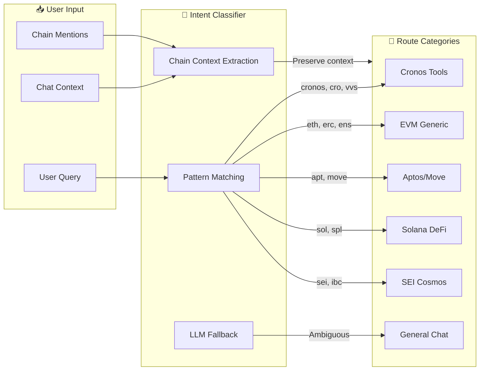

# Features

> **Complete Feature Documentation for Barzakh AI**

## Table of Contents
- [AI Models & Orchestration](#ai-models--orchestration)
- [Blockchain Tools](#blockchain-tools)
- [VVS Finance DEX Integration](#vvs-finance-dex-integration)
- [Authentication & Security](#authentication--security)
- [User Experience](#user-experience)
- [Subscription Tiers](#subscription-tiers)

---

## AI Models & Orchestration

### Supported Models

| Model ID | Display Name | Provider | Backend Model | Use Case |
|----------|--------------|----------|---------------|----------|
| `chat-model-small` | **GPT 4o** | OpenAI | `gpt-4o` | Fast, lightweight tasks |
| `chat-model-large` | **GPT 4.1** | OpenAI | `gpt-4.1-2025-04-14` | Complex, multi-step tasks |
| `chat-model-gigantic` | **GPT 5.1** | CometAPI | `gpt-5.1` | Experimental, next-gen |
| `chat-model-colossal` | **GPT 5.2** | CometAPI | `gpt-5.2` | Experimental, advanced |
| `chat-model-glm` | **GLM 4.6** ⭐ | CometAPI | `glm-4.6` | Default model, multilingual |
| `chat-model-claude` | **Claude Opus 4.5 Thinking** | CometAPI | `claude-opus-4-5-20251101-thinking` | Deep analysis, thinking mode |

> ⭐ **Default Model:** GLM 4.6 (`chat-model-glm`)

### Model Capabilities

| Model | Context | Streaming | Tool Calling | Best For |
|-------|---------|-----------|--------------|----------|
| **GPT-4o** | 128K | ✅ | ✅ | Fast responses, general queries |
| **GPT-4.1** | 1M | ✅ | ✅ | Complex reasoning, long documents |
| **GPT-5.x** | Extended | ✅ | ✅ | Cutting-edge performance |
| **Claude Opus 4.5** | 200K | ✅ | ✅ | Deep analysis, thinking mode |
| **GLM 4.6** | Extended | ✅ | ✅ | Multilingual, default model |

### Image Generation

| Model ID | Display Name | Provider | Description |
|----------|--------------|----------|-------------|
| `gemini-2.5-flash-image` | **Gemini 2.5 Flash Image** | CometAPI | Fast, high-fidelity image generation |

### Intent Classification & Routing



### AI Features

- **Streaming Responses** — Token-by-token streaming for real-time output
- **Tool Calling** — AI can invoke 50+ tools to fetch real data
- **Context Memory** — Maintains conversation history within sessions
- **Multi-Turn Conversations** — Coherent dialogue across multiple exchanges
- **Function Calling** — Structured tool invocation with JSON schema validation

---

## Blockchain Tools

### Tool Inventory by Chain (50+)

| Chain | Tools | Key Capabilities |
|-------|-------|------------------|
| **Cronos** | 8 | Balance, tokens, transactions, gas, market data, VVS swaps, pool info |
| **EVM (Generic)** | 6 | Etherscan, Zerion portfolio, ENS resolution, multi-chain wallet |
| **Aptos** | 10 | Coin balance, resources, modules, ANS names, transactions |
| **Solana** | 4 | Token balances, portfolio, market data |
| **Flow** | 3 | Cadence scripts, NFT collections |
| **SEI** | 4 | Cosmos queries, IBC transfers |
| **Zeta** | 3 | ZetaVM testnet, cross-chain messaging |
| **Monad** | 3 | Next-gen EVM (testnet) |
| **Wormhole** | 2 | Cross-chain bridge, guardian verification |
| **Utility** | 8 | Web search, news, X/Twitter, DeFi Llama, image generation |

### Chain-Specific Tools

#### Cronos
| Tool | Description |
|------|-------------|
| `cronos_get_balance` | Get native CRO balance for address |
| `cronos_get_transactions` | Fetch transaction history |
| `cronos_get_token_balances` | List all CRC-20 token balances |
| `cronos_get_nfts` | Retrieve NFT collections owned |
| `cronos_defi_positions` | Get DeFi protocol positions |
| `cronos_get_vvs_quote` | Get VVS swap quote |
| `cronos_get_vvs_pools` | Get VVS liquidity pools |

#### EVM Chains (Ethereum, Polygon)
| Tool | Description |
|------|-------------|
| `evm_get_balance` | Get native token balance |
| `evm_get_transactions` | Transaction history with pagination |
| `evm_get_token_balances` | ERC-20 token holdings |
| `evm_get_nfts` | ERC-721/1155 NFT inventory |
| `evm_ens_resolve` | Resolve ENS names to addresses |
| `evm_translate_transaction` | Human-readable transaction explanation |

#### Aptos
| Tool | Description |
|------|-------------|
| `aptos_get_account` | Account resources and modules |
| `aptos_get_balance` | APT and coin balances |
| `aptos_get_transactions` | Transaction history |
| `aptos_get_nfts` | NFT collections (Digital Assets) |
| `aptos_resolve_name` | Resolve ANS names |

#### Flow
| Tool | Description |
|------|-------------|
| `flow_get_account` | Account information |
| `flow_get_balance` | FLOW token balance |
| `flow_get_nfts` | NFT collections (TopShot, etc.) |

#### SEI
| Tool | Description |
|------|-------------|
| `sei_get_balance` | SEI token balance |
| `sei_get_delegations` | Staking delegations |
| `sei_get_transactions` | Transaction history |

#### Wormhole (Cross-Chain)
| Tool | Description |
|------|-------------|
| `wormhole_verify_message` | Verify cross-chain message |
| `wormhole_track_transfer` | Track cross-chain asset transfer |

### Data Aggregation Tools

#### DeFi Llama
| Tool | Description |
|------|-------------|
| `defillama_get_protocols` | List all DeFi protocols |
| `defillama_get_tvl` | Total Value Locked by protocol |
| `defillama_get_yields` | Yield farming opportunities |
| `defillama_get_stablecoins` | Stablecoin market data |

#### Zerion
| Tool | Description |
|------|-------------|
| `zerion_get_portfolio` | Complete portfolio analysis |
| `zerion_get_positions` | DeFi positions across protocols |
| `zerion_get_history` | Historical transactions |

### Search & Research Tools

| Tool | Description |
|------|-------------|
| `web_search` | Search the web using Tavily |
| `news_search` | Crypto news aggregation |
| `x_search` | Twitter/X sentiment search |
| `scrape_site` | Extract content from URLs |

### Image Tools

| Tool | Description |
|------|-------------|
| `create_image` | Generate images from text prompts |

---

## VVS Finance DEX Integration

### Available VVS Tools

```typescript
const vvsTools = {
  getVVSSwapQuote,    // Swap quotes between tokens
  getVVSTokenList,    // Available tokens
  getVVSPoolInfo,     // Liquidity pool info
};
```

### Swap Quote Example

```typescript
// Request
{
  inputToken: "CRO",
  outputToken: "USDC",
  inputAmount: 100
}

// Response
{
  expectedOutput: "25.42",
  priceImpact: "0.05%",
  route: ["CRO", "WCRO", "USDC"],
  minimumReceived: "25.29"
}
```

### Pool Information

| Data Point | Description |
|------------|-------------|
| Token Pair | Trading pair (e.g., CRO/USDC) |
| Liquidity | Total liquidity in pool |
| Volume 24h | 24-hour trading volume |
| APR | Annual percentage rate |

---

## Authentication & Security

### Authentication Methods

| Method | Description | Security |
|--------|-------------|----------|
| **Email/Password** | Traditional credentials | bcrypt (12 rounds) |
| **Google OAuth** | Single sign-on | OAuth 2.0 |
| **Wallet Connect** | Sign-in with Ethereum | EIP-4361 SIWE |

### Two-Factor Authentication

| Type | Standard | Window |
|------|----------|--------|
| **TOTP** | RFC 6238 | 30-second |
| **Email OTP** | 6-digit code | 10-minute TTL |

### Session Security

- **JWT Tokens** — HS256 signed, HttpOnly cookies
- **Session Duration** — 30-day max, sliding window
- **Secure Cookies** — SameSite=Lax, Secure=true, Path=/

### Sensitive Operations (Re-auth Required)

These operations require password + second factor:
- Account deletion
- Wallet binding/unbinding
- Email change
- Password change

> See [SECURITY.md](SECURITY.md) for full security documentation

---

## User Experience

### Chat Interface

| Feature | Description |
|---------|-------------|
| **Streaming Output** | Real-time token-by-token response display |
| **Syntax Highlighting** | Code blocks with language detection |
| **Markdown Rendering** | Rich text formatting in responses |
| **Message Editing** | Edit previous messages and regenerate |
| **Copy/Share** | Easy sharing of AI responses |
| **Chat History** | Searchable conversation history |

### Model Selection

- Switch between 6 LLM providers mid-conversation
- Visual model indicator in chat header
- Model-specific capabilities displayed

### File Attachments

| Type | Supported |
|------|-----------|
| Images | PNG, JPG, JPEG, GIF, WebP |
| Documents | PDF, TXT, MD |
| Max Size | 10MB per file |

### Progressive Web App (PWA)

| Feature | Description |
|---------|-------------|
| **Installable** | Add to home screen on mobile |
| **Responsive** | Optimized for all screen sizes |
| **Offline Support** | Service worker caching |
| **Push Notifications** | (Planned) Real-time alerts |

### Themes

| Theme | Description |
|-------|-------------|
| **Light** | Clean, professional appearance |
| **Dark** | Reduced eye strain, developer-friendly |
| **System** | Auto-detect OS preference |

### Accessibility

- Keyboard navigation
- Screen reader support
- High contrast mode
- Reduced motion support

---

## Subscription Tiers

### Free Tier
- **Daily Messages**: 10 messages per day
- **AI Models**: All 6 models
- **Blockchain Tools**: Full access to 50+ tools
- **Chat History**: Persistent
- **File Attachments**: Supported

### Pro Tier

| Billing Cycle | Daily Messages |
|---------------|----------------|
| **Monthly** | 50 messages/day |
| **Quarterly** | 100 messages/day |
| **Yearly** | 150 messages/day |

**Includes:**
- All 6 AI models
- Image generation (Gemini 2.5 Flash)
- Full blockchain tools access
- Unlimited chat history

### Ultimate Tier

| Billing Cycle | Daily Messages |
|---------------|----------------|
| **Monthly** | 250 messages/day |
| **Quarterly** | 350 messages/day |
| **Yearly** | 500 messages/day |

**Includes:**
- Everything in Pro
- Priority tool execution
- Priority support
- Early access to new features

### Payment Methods

- **x402 Crypto** — USDC on Cronos (gasless)
- **Stripe** — Credit/debit cards

> See [PAYMENTS.md](PAYMENTS.md) for x402 protocol details

---

## Upcoming Features

- [ ] Custom AI agents with saved prompts
- [ ] Portfolio alerts and notifications
- [ ] Social trading signals
- [ ] Team collaboration workspaces
- [ ] API access for developers
- [ ] Webhook integrations
