# Payments

> **x402 Crypto Payment Protocol Documentation**

## Table of Contents
- [Overview](#overview)
- [Gasless Payment Flow](#gasless-payment-flow)
- [EIP-712 Signature](#eip-712-signature)
- [Subscription Management](#subscription-management)
- [Supported Chains](#supported-chains)

---

## Overview

Barzakh AI implements the **x402 protocol** for gasless USDC payments on Cronos. This enables users to pay for subscriptions using crypto without needing to hold native tokens for gas fees.

### Key Features

| Feature | Description |
|---------|-------------|
| **Gasless Transactions** | Users sign EIP-712 typed data, facilitator pays gas |
| **EIP-3009 Standard** | TransferWithAuthorization for gasless transfers |
| **Wallet Verification** | EIP-191 signature to prove ownership |
| **Instant Activation** | Subscription activates immediately on confirmation |
| **Multi-Chain Ready** | Architecture supports multiple chains |

---

## Gasless Payment Flow

The x402 implementation uses **EIP-3009 TransferWithAuthorization** for gasless USDC payments:

```mermaid
sequenceDiagram
    autonumber
    participant User as 👤 User
    participant Frontend as 🖥️ Frontend
    participant API as 📡 Backend API
    participant Wallet as 🔐 Wallet
    participant Facilitator as ⚡ Cronos Facilitator
    participant Chain as ⛓️ Blockchain

    Note over User,Chain: Step 1: Wallet Verification
    User->>Frontend: Connect Wallet
    Frontend->>API: GET /api/billing/x402/verify-wallet?address=0x...
    API-->>Frontend: Nonce Message (EIP-191)
    
    Frontend->>Wallet: Sign Message Request
    User->>Wallet: Approve Signature
    Wallet-->>Frontend: Signature (65 bytes)
    
    Frontend->>API: POST /api/billing/x402/verify-wallet
    Note over API: ecrecover(hash, sig) == address
    API-->>Frontend: Wallet Verified ✓

    Note over User,Chain: Step 2: Payment Initialization
    Frontend->>API: POST /api/billing/x402/subscribe
    API-->>Frontend: 402 Payment Required<br/>{amount, recipient, paymentRequirements}

    Note over User,Chain: Step 3: EIP-712 Signature (Gasless)
    Frontend->>Frontend: Build EIP-712 TypedData<br/>(TransferWithAuthorization)
    Frontend->>Wallet: signTypedData_v4
    User->>Wallet: Approve Signature
    Wallet-->>Frontend: EIP-712 Signature

    Note over User,Chain: Step 4: Settlement
    Frontend->>API: POST /api/billing/x402/settle<br/>{paymentHeader, paymentRequirements}
    API->>Facilitator: Verify + Submit Transaction
    Facilitator->>Chain: transferWithAuthorization()
    Chain-->>Facilitator: TX Receipt
    Facilitator-->>API: {txHash, blockNumber}
    
    API->>API: Activate Subscription<br/>Set x402PeriodEnd
    API-->>Frontend: 200 OK - Subscription Active
```



### Step-by-Step Breakdown

#### 1. Wallet Verification
- User connects wallet (MetaMask, RainbowKit, etc.)
- Backend generates unique nonce message
- User signs message to prove wallet ownership
- Backend recovers signer address via `ecrecover`

#### 2. Payment Initialization
- Frontend requests subscription for selected plan
- Backend returns `402 Payment Required` with:
  - Payment amount (in USDC atomic units)
  - Recipient address (facilitator)
  - Chain ID and deadline

#### 3. EIP-712 Signature (Gasless)
- Frontend builds EIP-712 typed data structure
- User signs using `signTypedData_v4`
- No gas required from user at this step

#### 4. Settlement
- Backend submits signed authorization to facilitator
- Facilitator calls `transferWithAuthorization()` on-chain
- Facilitator pays gas fees
- Backend activates subscription on success

---

## EIP-712 Signature

### Domain Configuration

```typescript
// EIP-712 Domain for USDC.e on Cronos
const domain = {
  name: "Bridged USDC (Stargate)",
  version: "1",
  chainId: 338, // Cronos Testnet
  verifyingContract: "0xc01efAaF7C5C61bEbFAeb358E1161b537b8bC0e0",
};
```

### Type Definitions

```typescript
// EIP-3009 TransferWithAuthorization Types
const types = {
  TransferWithAuthorization: [
    { name: "from", type: "address" },
    { name: "to", type: "address" },
    { name: "value", type: "uint256" },
    { name: "validAfter", type: "uint256" },
    { name: "validBefore", type: "uint256" },
    { name: "nonce", type: "bytes32" },
  ],
};
```

### Example Message

```typescript
const message = {
  from: "0xUserWalletAddress...",
  to: "0xFacilitatorAddress...",
  value: "5000000", // 5 USDC (6 decimals)
  validAfter: 0,
  validBefore: Math.floor(Date.now() / 1000) + 3600, // 1 hour
  nonce: "0x..." // Random 32 bytes
};
```

---

## Subscription Management

### State Transitions

| Event | Action |
|-------|--------|
| **Payment Success** | Set `tier`, `x402PeriodEnd`, reset `dailyMessageRemaining` |
| **Real-time Check** | Chat route checks `x402PeriodEnd` on every request |
| **Cron Job** | Every 6 hours, downgrade expired subscriptions |
| **Cancel at Period End** | Set `x402CancelAtPeriodEnd = true`, keep benefits until expiry |
| **Cancel Immediately** | Downgrade to `free` tier instantly |

### Subscription Tiers

| Tier | Daily Messages | Billing Options |
|------|----------------|-----------------|
| **Free** | 10 | N/A |
| **Pro** | 50-150 | Monthly, Quarterly, Yearly |
| **Ultimate** | 250-500 | Monthly, Quarterly, Yearly |

### Expiry Handling

The cron job at `/api/cron/check-subscriptions` runs every 6 hours to:

1. Query all users where `x402PeriodEnd < now()`
2. Downgrade tier to `free`
3. Reset message limits
4. Log expiration for auditing

```typescript
// Cron schedule (vercel.json)
{
  "path": "/api/cron/check-subscriptions",
  "schedule": "0 */6 * * *"
}
```

---

## Supported Chains

### Current

| Chain | Network | USDC Contract | Status |
|-------|---------|---------------|--------|
| **Cronos Testnet** | Testnet (338) | `0xc01efAaF7C5C61bEbFAeb358E1161b537b8bC0e0` | ✅ Active |

### Planned

| Chain | Network | Status |
|-------|---------|--------|
| **Cronos Mainnet** | Mainnet (25) | 🔜 Planned |
| **Ethereum** | Mainnet (1) | 🔜 Planned |
| **Polygon** | PoS (137) | 🔜 Planned |

---

## API Endpoints

| Endpoint | Method | Description |
|----------|--------|-------------|
| `/api/billing/x402/verify-wallet` | GET | Get nonce message for wallet verification |
| `/api/billing/x402/verify-wallet` | POST | Verify wallet signature |
| `/api/billing/x402/subscribe` | POST | Initiate x402 payment (returns 402) |
| `/api/billing/x402/settle` | POST | Submit signed authorization |
| `/api/billing/x402/verify` | POST | Verify on-chain transaction |

> See [API.md](API.md) for full endpoint documentation

---

## Security Considerations

### Nonce Management
- Random 32-byte nonces prevent replay attacks
- Nonces are tracked on-chain in USDC contract

### Deadline Enforcement
- `validBefore` timestamp prevents stale signatures
- Recommended: 1 hour validity window

### Wallet Verification
- EIP-191 signature required before payment
- Prevents unauthorized payments from unverified wallets

### Facilitator Security
- Facilitator private key stored securely
- Rate limiting on settlement endpoint
- Transaction simulation before submission
