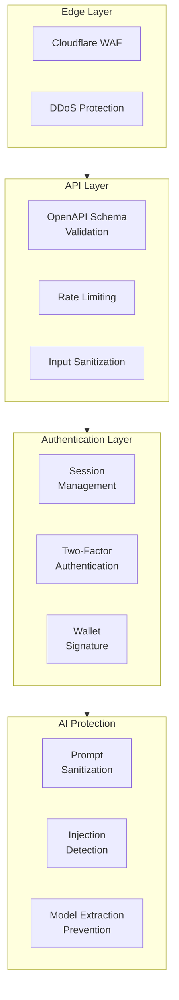
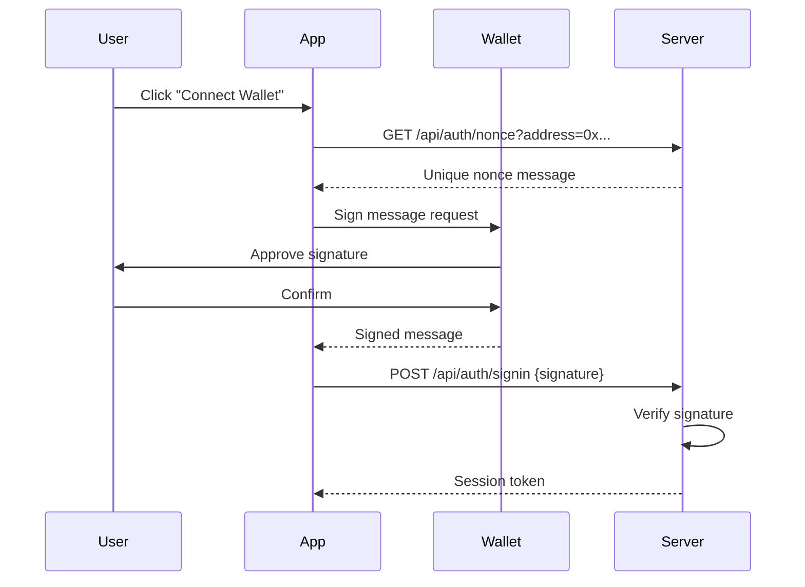
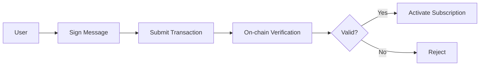

# Security

Barzakh AI implements multiple layers of security to protect users, data, and AI systems.

---

## 🛡️ Security Architecture



---

## 🔐 Authentication

### Multi-Factor Authentication

| Method | Description | Security Level |
|--------|-------------|----------------|
| Password | Hashed with bcrypt | Base |
| OAuth | Google SSO integration | Enhanced |
| Wallet Signature | Cryptographic proof | High |
| TOTP 2FA | Time-based codes | Maximum |

### Session Security

- **Secure Cookies** - HttpOnly, SameSite, Secure flags
- **Session Rotation** - On privilege escalation
- **Idle Timeout** - Automatic logout after inactivity
- **Device Tracking** - Optional trusted device management

### Wallet Authentication Flow



---

## 🚨 AI Security

### Protected Against

| Threat | Protection |
|--------|------------|
| **Prompt Injection** | Input sanitization, output filtering |
| **Jailbreak Attempts** | System prompt hardening |
| **Model Extraction** | Rate limiting, query analysis |
| **Data Exfiltration** | Output monitoring |
| **Adversarial Inputs** | Homoglyph detection, RTL filtering |

### Input Sanitization

All user inputs are processed through multiple sanitization layers:

1. **Character Filtering** - Remove invisible characters, control codes
2. **Homoglyph Detection** - Detect lookalike character substitution
3. **RTL Override** - Strip bidirectional text overrides
4. **Length Limits** - Enforce maximum input sizes
5. **Pattern Matching** - Detect known injection patterns

### Output Safety

- Content filtering for harmful outputs
- PII detection and redaction
- Link and URL validation
- Executable code sandboxing

---

## 🌐 API Security

### Cloudflare API Shield

All API requests are validated against OpenAPI schema:

```yaml
# Example validation rules
parameters:
  - name: address
    in: query
    schema:
      type: string
      pattern: "^0x[a-fA-F0-9]{40}$"  # Valid Ethereum address

requestBody:
  content:
    application/json:
      schema:
        properties:
          code:
            type: string
            minLength: 6
            maxLength: 6
            pattern: "^[0-9]{6}$"  # 6-digit OTP only
```

### Rate Limiting

| Endpoint Category | Limit | Window |
|-------------------|-------|--------|
| Authentication | 10 requests | 1 minute |
| Chat/AI | 60 requests | 1 minute |
| Billing | 20 requests | 1 minute |
| OTP Requests | 3 requests | 10 minutes |

### Request Validation

- **Type Checking** - Ensure correct data types
- **Size Limits** - Maximum payload sizes
- **Pattern Matching** - Regex validation for formats
- **Required Fields** - Mandatory parameter enforcement

---

## 💳 Payment Security

### Stripe Integration

- PCI DSS Level 1 compliant
- Tokenized card storage
- 3D Secure authentication
- Fraud detection

### x402 Crypto Payments



- Wallet ownership verification before payment
- On-chain transaction confirmation
- No private keys stored server-side
- Multi-chain support with chain-specific validation

---

## 🗄️ Data Protection

### Data at Rest

- Database encryption (AES-256)
- Encrypted file storage
- Secure key management

### Data in Transit

- TLS 1.3 for all connections
- Certificate pinning for mobile
- HSTS enforcement

### Data Retention

- Chat history: User-controlled deletion
- Session data: 30-day expiry
- Audit logs: 90-day retention
- Payment data: Handled by Stripe

---

## 🔍 Monitoring & Incident Response

### Real-Time Monitoring

- Anomaly detection for unusual patterns
- Failed authentication tracking
- API abuse detection
- AI output monitoring

### Incident Response

1. **Detection** - Automated alerting
2. **Containment** - Rate limiting, IP blocking
3. **Investigation** - Log analysis
4. **Recovery** - Service restoration
5. **Post-Mortem** - Root cause analysis

---

## 📋 Compliance

| Standard | Status |
|----------|--------|
| GDPR | Data protection compliant |
| SOC 2 Type II | In progress |
| PCI DSS | Via Stripe (Level 1) |

---

## 🐛 Security Reporting

Found a vulnerability? Contact us:

- **Email**: security@barzakh.tech
- **Response Time**: 24-48 hours

We appreciate responsible disclosure and will acknowledge security researchers who help improve our platform.
