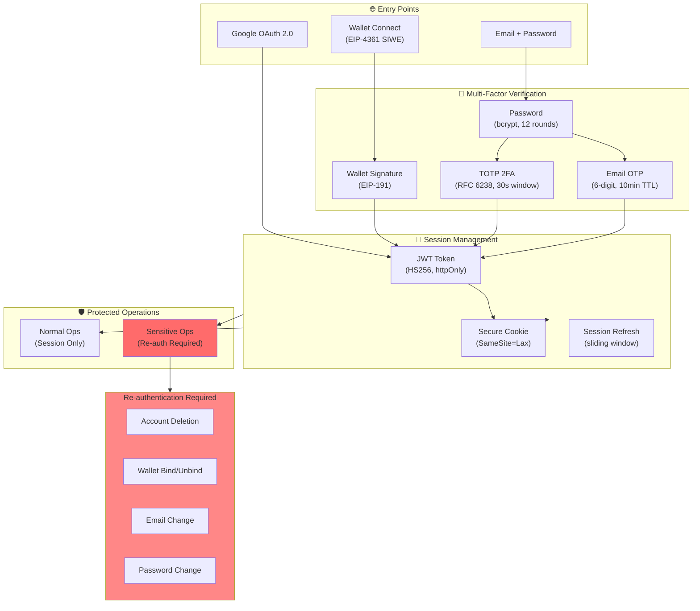

# Security

> **Barzakh AI Security Architecture and Threat Protection**

## Table of Contents
- [Security Philosophy](#security-philosophy)
- [5-Layer Defense Architecture](#5-layer-defense-architecture)
- [Authentication Security](#authentication-security)
- [API Protection](#api-protection)
- [AI Security](#ai-security)
- [Data Protection](#data-protection)
- [Incident Response](#incident-response)

---

## Security Philosophy

Barzakh AI implements **defense in depth** with multiple overlapping security layers. We assume that any single layer may fail, so we design systems where attackers would need to bypass multiple independent defenses.

### Key Principles
- **Zero Trust** — Verify all requests, trust nothing by default
- **Least Privilege** — Minimal access for all components
- **Defense in Depth** — Multiple independent security layers
- **Fail Secure** — Default to denying access on errors

---

## 5-Layer Defense Architecture

```
┌──────────────────────────────────────────────────────────────────────────────────────┐
│                           AI SECURITY DEFENSE LAYERS                                 │
├──────────────────────────────────────────────────────────────────────────────────────┤
│                                                                                      │
│  ┌──────────────────────────────────────────────────────────────────────────────┐    │
│  │  LAYER 1: INPUT SANITIZATION                                                 │    │
│  │  ┌─────────────┐ ┌─────────────┐ ┌─────────────┐ ┌──────────────────────┐    │    │
│  │  │ Homoglyph   │ │ Invisible   │ │ RTL/LTR     │ │ Unicode              │    │    │
│  │  │ Detection   │ │ Char Strip  │ │ Override    │ │ Normalization        │    │    │
│  │  │ (Lookalikes)│ │ (U+200B,etc)│ │ Removal     │ │ (NFC/NFKC)           │    │    │
│  │  └─────────────┘ └─────────────┘ └─────────────┘ └──────────────────────┘    │    │
│  └──────────────────────────────────────────────────────────────────────────────┘    │
│                                       │                                              │
│                                       ▼                                              │
│  ┌──────────────────────────────────────────────────────────────────────────────┐    │
│  │  LAYER 2: PROMPT INJECTION DEFENSE                                           │    │
│  │  ┌─────────────┐ ┌─────────────┐ ┌─────────────┐ ┌──────────────────────┐    │    │
│  │  │ Direct      │ │ Indirect    │ │ Jailbreak   │ │ Role/Context         │    │    │
│  │  │ Injection   │ │ Injection   │ │ Pattern     │ │ Manipulation         │    │    │
│  │  │ Detection   │ │ (via URLs)  │ │ Matching    │ │ Prevention           │    │    │
│  │  └─────────────┘ └─────────────┘ └─────────────┘ └──────────────────────┘    │    │
│  └──────────────────────────────────────────────────────────────────────────────┘    │
│                                       │                                              │
│                                       ▼                                              │
│  ┌──────────────────────────────────────────────────────────────────────────────┐    │
│  │  LAYER 3: MEDIA & FILE PROTECTION                                            │    │
│  │  ┌─────────────┐ ┌─────────────┐ ┌─────────────┐ ┌──────────────────────┐    │    │
│  │  │ Polyglot    │ │ EXIF/Meta   │ │Steganography│ │ File Type            │    │    │
│  │  │ File        │ │ Data Strip  │ │ Detection   │ │ Validation           │    │    │
│  │  │ Detection   │ │             │ │             │ │ (Magic Bytes)        │    │    │
│  │  └─────────────┘ └─────────────┘ └─────────────┘ └──────────────────────┘    │    │
│  └──────────────────────────────────────────────────────────────────────────────┘    │
│                                       │                                              │
│                                       ▼                                              │
│  ┌──────────────────────────────────────────────────────────────────────────────┐    │
│  │  LAYER 4: MODEL PROTECTION                                                   │    │
│  │  ┌─────────────┐ ┌─────────────┐ ┌─────────────┐ ┌──────────────────────┐    │    │
│  │  │ Sponge      │ │ Model       │ │ Model       │ │ Output               │    │    │
│  │  │ Attack      │ │ Extraction  │ │ Inversion   │ │ Filtering            │    │    │
│  │  │ Prevention  │ │ Defense     │ │ Guard       │ │ (PII, Secrets)       │    │    │
│  │  └─────────────┘ └─────────────┘ └─────────────┘ └──────────────────────┘    │    │
│  └──────────────────────────────────────────────────────────────────────────────┘    │
│                                       │                                              │
│                                       ▼                                              │
│  ┌──────────────────────────────────────────────────────────────────────────────┐    │
│  │  LAYER 5: RUNTIME MONITORING                                                 │    │
│  │  ┌─────────────┐ ┌─────────────┐ ┌─────────────┐ ┌──────────────────────┐    │    │
│  │  │ Rate        │ │ Anomaly     │ │ x402 Expiry │ │ Audit                │    │    │
│  │  │ Limiting    │ │ Detection   │ │ Check       │ │ Logging              │    │    │
│  │  │ (Tier-based)│ │ (Pattern)   │ │ (Real-time) │ │ (Compliance)         │    │    │
│  │  └─────────────┘ └─────────────┘ └─────────────┘ └──────────────────────┘    │    │
│  └──────────────────────────────────────────────────────────────────────────────┘    │
│                                                                                      │
└──────────────────────────────────────────────────────────────────────────────────────┘
```

---

## Threat Protection Matrix

### Layer 1: Input Sanitization

| Threat | Attack Vector | Defense |
|--------|---------------|---------|
| **Homoglyph Attack** | Lookalike Unicode characters (е vs e, а vs a) | Character normalization, confusable detection using Unicode NFKC |
| **Invisible Characters** | Zero-width joiners, BOM, soft hyphens (U+200B, U+FEFF, U+00AD) | Whitespace stripping, control character removal |
| **RTL Override** | Right-to-left override characters (U+202A-U+202E) | Bidi control character removal |
| **Unicode Exploits** | Normalization attacks, overlong encodings | NFC/NFKC normalization, strict UTF-8 validation |

### Layer 2: Prompt Injection Defense

| Threat | Attack Vector | Defense |
|--------|---------------|---------|
| **Direct Injection** | "Ignore previous instructions" | Pattern matching, input boundary enforcement |
| **Indirect Injection** | Malicious content in fetched URLs/files | Content isolation, sandboxed parsing |
| **Jailbreak** | DAN prompts, role manipulation, "pretend" attacks | System prompt hardening, output monitoring |
| **Context Manipulation** | Fake system messages, role confusion | Clear message delineation, role validation |

### Layer 3: Media & File Protection

| Threat | Attack Vector | Defense |
|--------|---------------|---------|
| **Polyglot Files** | Images containing executable code (GIFAR, etc.) | Magic byte validation, re-encoding |
| **EXIF Exploitation** | Malicious metadata in images | Complete EXIF/metadata stripping |
| **Steganography** | Hidden data encoded in pixels | Image re-encoding, lossy compression |
| **MIME Confusion** | Content-type mismatch | Strict file type validation by magic bytes |

### Layer 4: Model Protection

| Threat | Attack Vector | Defense |
|--------|---------------|---------|
| **Sponge Attacks** | Queries designed to maximize compute | Token limits, complexity analysis, timeouts |
| **Model Extraction** | Systematic querying to clone model | Rate limiting, query pattern analysis |
| **Model Inversion** | Reconstructing training data | Output perturbation, differential privacy |
| **Data Exfiltration** | PII/secrets in outputs | Output filtering, regex-based redaction |

---

## Authentication Security

### Authentication Architecture



### Password Security

| Aspect | Implementation |
|--------|----------------|
| **Hashing** | bcrypt with cost factor 12 |
| **Minimum Length** | 8 characters |
| **Breach Detection** | (Planned) HaveIBeenPwned integration |

### Two-Factor Authentication

| Type | Standard | Parameters |
|------|----------|------------|
| **TOTP** | RFC 6238 | 30-second window, 6 digits, SHA-1 |
| **Email OTP** | Custom | 6 digits, 10-minute TTL, rate limited |

### Wallet Authentication (EIP-4361 SIWE)

```
1. Server generates cryptographic nonce (UUID v4)
2. Nonce stored with 5-minute TTL
3. User signs message containing nonce
4. Server recovers signer address via ecrecover
5. Verify recovered address matches claimed address
6. Verify nonce not expired or previously used
7. Issue session token
```

### Session Security

| Aspect | Implementation |
|--------|----------------|
| **Token Format** | JWT (HS256) |
| **Cookie Flags** | HttpOnly, Secure, SameSite=Lax |
| **Session Duration** | 30 days max |
| **Refresh Strategy** | Sliding window |

### Sensitive Operation Re-Authentication

Operations requiring fresh authentication proof:
- Account deletion
- Wallet binding/unbinding
- Email change
- Password change

**Requires:**
- Current password, AND
- 2FA token (if enabled), OR
- Email OTP (if 2FA not enabled)

---

## API Protection

### Cloudflare API Shield

All API requests are validated against OpenAPI 3.0 schema:

```yaml
# Example validation rules
parameters:
  - name: address
    in: query
    required: true
    schema:
      type: string
      pattern: "^0x[a-fA-F0-9]{40}$"  # Valid Ethereum address

requestBody:
  content:
    application/json:
      schema:
        properties:
          totpCode:
            type: string
            minLength: 6
            maxLength: 6
            pattern: "^[0-9]{6}$"  # 6-digit OTP only
```

### Rate Limiting

| Endpoint Category | Limit | Window | Strategy |
|-------------------|-------|--------|----------|
| Authentication | 10 req | 1 min | Token bucket |
| Chat/AI | 60 req | 1 min | Sliding window |
| Billing | 20 req | 1 min | Token bucket |
| OTP Requests | 3 req | 10 min | Fixed window |

### WAF Rules

- SQL injection patterns
- XSS attempt detection
- Path traversal blocking
- Request size limits
- Bot detection

### DDoS Protection

- Cloudflare global anycast network
- Automatic attack mitigation
- Challenge pages for suspicious traffic

---

## AI Security

### Prompt Security

| Aspect | Implementation |
|--------|----------------|
| **System Prompt** | Hardened 58KB+ prompt with clear boundaries |
| **User/Assistant Separation** | Clear message role delineation |
| **Tool Permissions** | Explicit tool allowlist per request |

### Input Validation

```typescript
// Simplified sanitization pipeline
function sanitize(input: string): string {
  return input
    .normalize('NFC')           // Unicode normalization
    .replace(INVISIBLE_REGEX, '') // Remove invisible chars
    .replace(RTL_REGEX, '')     // Remove RTL overrides
    .replace(HOMOGLYPH_REGEX, normalizeHomoglyphs) // Normalize lookalikes
}
```

### Output Filtering

- PII detection (email, phone, SSN patterns)
- API key/secret detection
- Executable code sandboxing
- URL validation

---

## Data Protection

### Data at Rest

| Aspect | Implementation |
|--------|----------------|
| **Database** | PostgreSQL with connection encryption |
| **File Storage** | Cloudflare R2 with encryption at rest |
| **Secrets** | Environment variables, never in code |

### Data in Transit

| Aspect | Implementation |
|--------|----------------|
| **TLS Version** | 1.3 minimum |
| **Certificate** | Cloudflare managed |
| **HSTS** | Enabled with preload |

### Data Retention

| Data Type | Retention |
|-----------|-----------|
| Chat History | User-controlled deletion |
| Session Data | 30 days max |
| Audit Logs | 90 days |
| Payment Data | Handled by blockchain |

---

## Incident Response

### Monitoring

- Real-time anomaly detection
- Failed authentication tracking
- Unusual query pattern detection
- Rate limit breach alerts

### Response Procedures

1. **Detection** — Automated alerting
2. **Containment** — IP blocking, rate limiting, account suspension
3. **Investigation** — Log analysis, impact assessment
4. **Recovery** — Service restoration
5. **Post-Mortem** — Root cause analysis, fixes deployed

---

## Security Contact

Found a vulnerability? Report responsibly:

- **Email**: security@barzakh.tech
- **Response Time**: 24-48 hours
- **Scope**: All Barzakh AI services

We appreciate responsible disclosure and will acknowledge researchers who help improve our security.
